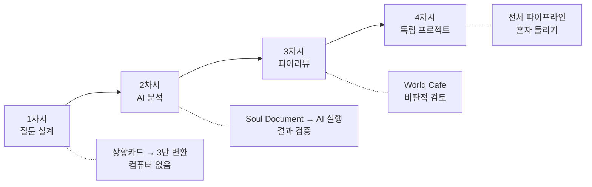
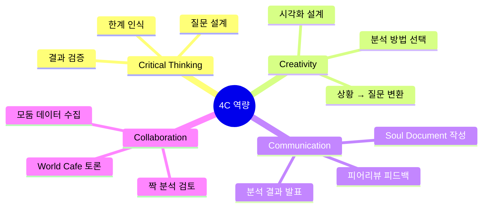
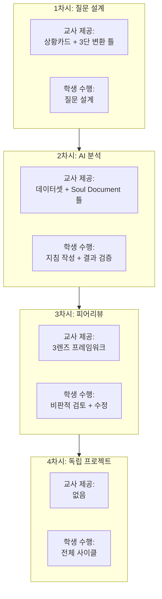

# Ch.1 --- 이 수업 시리즈의 설계 철학

**Part 1: 질문을 설계하라 | 50분**

---

<div class="plotly-demo" markdown>
<div class="demo-label">4차시를 마친 학생들이 만들어낼 분석 결과 미리보기</div>
<iframe src="../demos/hero_dashboard.html"></iframe>
</div>

!!! abstract "이 장의 목적"
    이 장은 **수업을 설계한 교사**의 관점에서 4차시 전체 흐름과 철학적 배경을 설명합니다.
    수업에 들어가기 전, "왜 이렇게 설계했는가"를 이해하면 수업 중 판단이 빨라집니다.

---

## 1. 수업 시리즈 개요

이 수업은 **데이터 분석을 가르치는 4차시 수업 시리즈**입니다. 그러나 기존의 데이터 수업과 결정적으로 다른 점이 있습니다.

| 구분 | 기존 데이터 수업 | 이 수업 시리즈 |
|------|----------------|---------------|
| **도구** | 엑셀, 파이썬 직접 코딩 | AI가 분석 실행 |
| **학생 역할** | 코드 작성자 | 분석 설계자 + 검증자 |
| **핵심 활동** | "이 코드를 따라 치세요" | "이 질문을 어떻게 확인하지?" |
| **평가 기준** | 코드 정확성 | 질문의 질 + 검증의 깊이 |
| **전이 가능성** | 특정 도구에 종속 | 도구가 바뀌어도 사고는 남음 |

!!! tip "핵심 한 문장"
    **"AI는 분석을 실행하지만, 설계와 검증은 사람의 몫이다."**
    이것이 4차시 전체를 관통하는 원리입니다.

---

## 2. 핵심 철학: 세 가지 전제

### 전제 1: 도구가 바뀌어도 사고는 남는다

엑셀이 사라지고 AI가 왔습니다. 내일은 또 다른 도구가 올 것입니다.
그러나 **"이 데이터에서 무엇을 물어야 하는가?"**라는 질문은 도구와 무관합니다.

우리가 가르치는 것은 도구 사용법이 아니라 **분석적 사고의 구조**입니다.

### 전제 2: 코드의 위치를 재배치하라

기존 수업에서 학생은 코드를 **직접 작성**했습니다. 이 수업에서 코드는 **AI 안에** 있습니다.
학생의 역할은 코드 작성에서 **지시 설계 + 결과 검증**으로 이동합니다.

```
기존:  학생 → [코드 작성] → 결과
이 수업: 학생 → [지시 설계] → AI → [코드 실행] → 결과 → [학생이 검증]
```

### 전제 3: 결과물이 아니라 생성기를 만들어라

학생이 제출하는 것은 "분석 보고서" 하나가 아닙니다.
**Soul Document**(분석 지침서)라는 **생성기**를 만듭니다.
이 지침서를 AI에게 주면 언제든 분석을 재실행할 수 있습니다.

!!! note "교사를 위한 비유"
    레시피(Soul Document)를 잘 쓰면, 어떤 주방(AI 도구)에서든 같은 요리를 만들 수 있습니다.
    학생이 만드는 것은 요리가 아니라 레시피입니다.

---

## 3. 4차시 전체 흐름



| 차시 | 주제 | 핵심 활동 | 환경 | 산출물 |
|------|------|----------|------|--------|
| **1차시** | 모호함에서 질문으로 | 상황카드 → 3단 질문 변환 | 일반 교실 (컴퓨터 없음) | 데이터 질문 + 역설계 시트 |
| **2차시** | AI에게 분석 시키기 | Soul Document 작성 → AI 실행 → 검증 | 컴퓨터실 | Soul Document + 검증된 분석 결과 |
| **3차시** | 짝의 분석 부수기 | World Cafe 피어리뷰 (3렌즈) | 컴퓨터실 | 피어리뷰 시트 + 수정된 분석 |
| **4차시** | 처음부터 끝까지 | 독립 프로젝트 전체 사이클 | 컴퓨터실 | 완전한 분석 포트폴리오 |

---

## 4. 네 가지 설계 원리

### 원리 1: Question-First (질문 우선)

데이터를 먼저 주고 "뭐가 보이나요?"라고 묻지 않습니다.
**상황을 먼저 주고** "이걸 어떻게 확인하지?"라고 묻습니다.

질문이 분석의 방향을 결정합니다. 좋은 질문 없이 좋은 분석은 불가능합니다.

!!! warning "흔한 실수"
    "데이터를 넣고 AI한테 분석해달라고 하면 되지 않나요?"
    → 질문 없는 분석은 **답 없는 시험**과 같습니다. AI도 무엇을 찾아야 할지 모릅니다.

### 원리 2: Gradual Release (점진적 이양)

교사의 스캐폴딩(단계적 도움)을 차시마다 줄여갑니다.

```
1차시: 교사가 상황을 준다 → [질문 설계] ← 학생이 한다
2차시: 교사가 데이터를 준다 → [AI 실행+검증] ← 학생이 한다
3차시: 교사가 프레임을 준다 → [비판적 검토] ← 학생이 한다
4차시: 교사가 아무것도 안 준다 → [전체 사이클] ← 학생이 혼자 한다
```

!!! tip "왜 점진적 이양인가?"
    1차시부터 "다 알아서 해봐"라고 하면 학생은 막막합니다.
    반대로 4차시까지 계속 손잡아주면 독립성이 생기지 않습니다.
    **매 차시 하나씩 손을 놓는 것**이 핵심입니다.

### 원리 3: Verification Over Execution (실행보다 검증)

AI가 분석을 실행하는 시대에, 학생에게 남는 고유한 역할은 **검증**입니다.

- "이 평균값이 맞는가?" (계산 검증)
- "이 그래프가 질문에 답하는가?" (적합성 검증)
- "이 결론이 데이터로부터 타당한가?" (논리 검증)

### 원리 4: Limitations as Competence (한계 인식이 곧 역량)

AI의 한계를 아는 것이 AI를 잘 쓰는 것입니다.

- AI는 **상관관계를 인과관계로 착각**할 수 있습니다
- AI는 **이상치에 민감하게 반응**할 수 있습니다
- AI는 **맥락을 모른 채 패턴만 찾을** 수 있습니다

이런 한계를 인식하고 보정하는 것이 진짜 데이터 리터러시입니다.

---

## 5. 4C 역량 매핑



이 수업에서 4C 역량은 추상적 구호가 아니라 **구체적 활동**으로 구현됩니다.

| 역량 | 해당 차시 | 구체적 활동 |
|------|----------|------------|
| **비판적 사고** | 1, 2, 3차시 | 질문 검증, 결과 검증, 피어리뷰 |
| **창의성** | 1, 2차시 | 상황에서 질문 도출, 분석 설계 |
| **의사소통** | 2, 4차시 | Soul Document 작성, 분석 발표 |
| **협업** | 3차시 | World Cafe 피어리뷰 |

---

## 6. 성취기준 연결 (2022 개정 교육과정)

!!! note "적용 교과: 정보, 수학, 사회(통합사회)"
    이 수업은 단일 교과가 아닌 융합 수업으로 설계되었습니다.
    아래 성취기준은 가장 직접적으로 관련된 것들입니다.

### 정보 교과

| 성취기준 | 관련 차시 | 활동 |
|---------|----------|------|
| [9정04-01] 실생활 문제를 분석하여 해결 방안을 설계한다 | 1차시 | 상황카드 → 질문 설계 |
| [9정04-02] 데이터를 수집하고 구조화하여 분석한다 | 2차시 | Soul Document → AI 분석 |
| [9정04-03] 문제 해결 과정을 평가하고 개선한다 | 3차시 | 피어리뷰 + 재분석 |

### 수학 교과 (통계 영역)

| 성취기준 | 관련 차시 | 활동 |
|---------|----------|------|
| [9수05-03] 상관관계를 이해하고 산점도로 표현한다 | 2차시 | AI 분석 결과의 산점도 해석 |
| [9수05-04] 자료를 수집하고 분석하여 결론을 도출한다 | 4차시 | 독립 프로젝트 |

---

## 7. 교사를 위한 안내: 이 지도서 사용법

이 지도서는 **10개 장(chapter)**으로 구성되어 있습니다.

| 장 | 내용 | 언제 읽나 |
|----|------|----------|
| Ch.1 (이 장) | 설계 철학 + 전체 흐름 | 수업 시작 전 1회 |
| Ch.2 | 1차시 상세 지도안 | 1차시 수업 전 |
| Ch.3 | 상황카드 + 활동지 + 루브릭 | 1차시 준비 시 |
| Ch.4 | 2차시 상세 지도안 | 2차시 수업 전 |
| Ch.5 | Soul Document 작성 가이드 | 2차시 준비 시 |
| Ch.6 | 3차시 상세 지도안 | 3차시 수업 전 |
| Ch.7 | 피어리뷰 도구 + 가이드 | 3차시 준비 시 |
| Ch.8 | 4차시 상세 지도안 | 4차시 수업 전 |
| Ch.9 | 독립 프로젝트 가이드 | 4차시 준비 시 |
| Ch.10 | 평가 총괄 + FAQ | 전체 수업 후 |

!!! tip "추천 읽기 순서"
    1. **Ch.1**(이 장)을 먼저 읽어 전체 그림을 파악합니다.
    2. 각 차시 **수업 전날**, 해당 차시의 지도안(짝수 장)을 읽습니다.
    3. 수업 **당일 아침**, 해당 차시의 자료 장(홀수 장)에서 활동지를 출력합니다.

---

## 8. 스캐폴딩(단계적 도움)의 점진적 제거

이 수업 시리즈의 가장 중요한 설계 요소는 **스캐폴딩(단계적 도움)의 점진적 제거**입니다.



??? question "스캐폴딩을 더 빨리/느리게 제거해도 되나요?"
    **네, 학급 수준에 따라 조절할 수 있습니다.**

    - **상위 학급**: 1차시에서 상황카드 없이 자유 주제 선택 가능
    - **하위 학급**: 4차시에서도 Soul Document 틀을 일부 제공 가능

    핵심은 **방향**입니다. 매 차시마다 조금씩 더 놓아주세요.

---

## 9. 수업 전 체크리스트

??? success "1차시 전 준비물"
    - [ ] 상황카드 6종 인쇄 (모둠당 1세트)
    - [ ] 3단 변환 활동지 인쇄 (인당 1매)
    - [ ] 데이터 역설계 활동지 인쇄 (인당 1매)
    - [ ] 칠판/화이트보드에 "3단 변환" 예시 준비
    - [ ] 급식 만족도 등 도입용 일상 사례 준비

??? success "2차시 전 준비물"
    - [ ] 컴퓨터실 예약 확인
    - [ ] AI 도구 접속 테스트 (Claude, ChatGPT 등)
    - [ ] 학교 데이터셋 파일 학생 배포 준비
    - [ ] Soul Document 양식 인쇄 또는 디지털 배포
    - [ ] "나쁜 지시 vs 좋은 지시" 시연 준비
    - [ ] 검증 체크리스트 인쇄

!!! warning "환경 사전 확인"
    2차시부터는 **AI 도구 접속이 필수**입니다. 학교 네트워크에서 Claude 또는 ChatGPT 접속이 차단되어 있지 않은지 반드시 사전에 확인하세요. 차단된 경우 IT 관리자에게 미리 요청해야 합니다.

---

## 10. 자주 묻는 질문

??? question "AI를 쓰면 학생이 아무것도 안 배우는 거 아닌가요?"
    이 수업에서 AI는 **계산기**와 같은 위치입니다. 계산기가 있어도 "무엇을 계산해야 하는지"는 사람이 결정합니다. 마찬가지로 AI가 분석을 실행해도, **무엇을 분석할지 설계하고, 결과가 맞는지 검증하는 것**은 학생의 몫입니다. 오히려 코드 작성에 쏟던 시간을 사고에 쓸 수 있어 **더 깊은 학습**이 가능합니다.

??? question "특정 AI 도구를 꼭 써야 하나요?"
    아닙니다. 이 수업은 **도구에 종속되지 않도록** 설계되었습니다. Claude, ChatGPT, Gemini 등 어떤 AI 도구를 사용해도 됩니다. Soul Document는 어떤 AI에게 주어도 작동하는 **범용 지침서**입니다.

??? question "코딩을 전혀 못 하는 교사도 할 수 있나요?"
    **네, 가능합니다.** 이 수업에서 교사에게 필요한 것은 코딩 능력이 아니라 **질문 설계 능력**과 **비판적 사고 촉진 능력**입니다. AI가 코드를 대신 작성하므로, 교사는 학생의 질문의 질과 검증 과정에 집중하면 됩니다.

??? question "4차시가 부족하면 어떻게 하나요?"
    각 차시는 50분 기준이지만, 학급 상황에 따라 **6~8차시로 확장** 가능합니다. 예를 들어 1차시와 2차시 사이에 "데이터 이해하기" 차시를 추가하거나, 3차시를 두 번에 나누어 진행할 수 있습니다.

---

!!! abstract "다음 장 미리보기"
    **Ch.2 — 1차시 지도안: 모호함에서 질문으로**

    급식이 맛없다는 느낌을 데이터 질문으로 바꾸는 50분 수업의 분 단위 지도안입니다.
    상황카드를 활용한 3단 변환 활동과 데이터 역설계 활동을 상세히 안내합니다.
