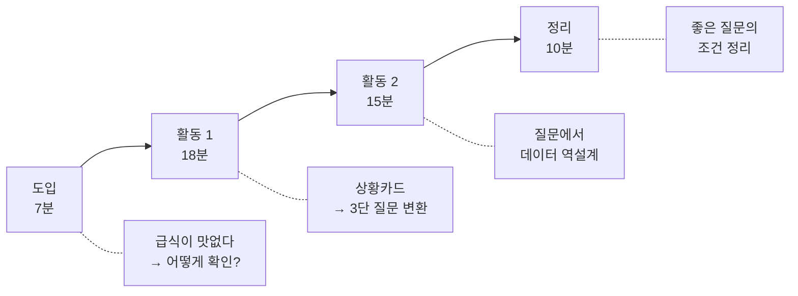
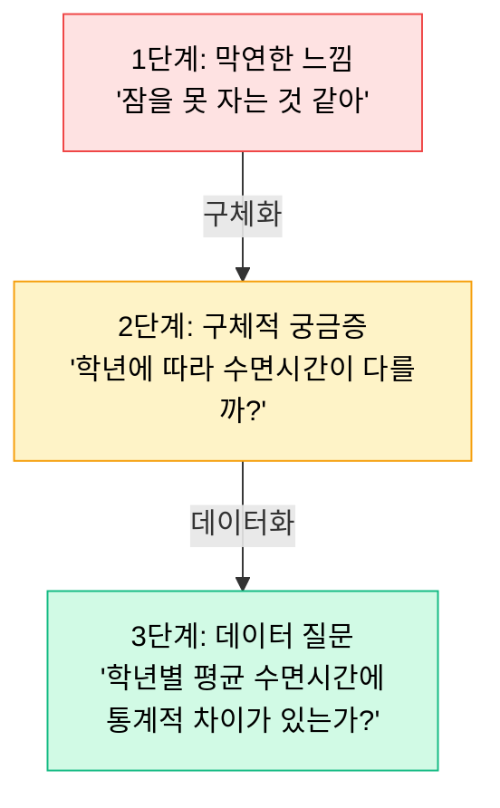

# Ch.2 --- 1차시 지도안: 모호함에서 질문으로

**Part 1: 질문을 설계하라 | 2시간 (실제 수업 50분 + 교사 준비/심화)**

---

## 수업 개요

| 항목 | 내용 |
|------|------|
| **과목** | 정보 / 수학(통계) / 융합 |
| **차시** | 1/4차시 |
| **시간** | 50분 |
| **수업 형태** | 일반 교실 (컴퓨터 없음) |
| **모둠 구성** | 4인 1모둠 (6~8모둠) |
| **준비물** | 상황카드 6종(모둠당 1세트), 활동지(인당 1매), 필기구 |
| **핵심 질문** | "느낌을 어떻게 숫자로 확인할 수 있을까?" |

---

## 왜 이 수업인가

### 기존 데이터 수업의 문제점

!!! warning "흔한 수업 시나리오"
    1. 교사: "엑셀 열고, A열에 이름, B열에 점수를 입력하세요"
    2. 학생: (시키는 대로 따라 침)
    3. 교사: "평균 함수를 써서 평균을 구하세요"
    4. 학생: "선생님, 평균 구했는데... 그래서요?"

    **문제**: 학생은 도구 조작법을 배웠지만, **왜 평균을 구해야 하는지** 모릅니다.

### 이 수업의 해법

데이터 분석의 출발점은 도구가 아니라 **질문**입니다.
이 수업은 컴퓨터 없이, 오직 **생각만으로** 시작합니다.

| 기존 접근 | 이 수업의 접근 |
|----------|---------------|
| 도구 먼저 → 데이터 → (질문 없음) | **상황 먼저 → 질문 → 데이터 역설계** |
| "엑셀 켜세요" | "이 상황에서 뭘 확인하고 싶나요?" |
| 기술 습득 목표 | 사고력 습득 목표 |

---

## 학습목표

!!! note "이 수업이 끝나면 학생은..."
    1. 일상의 **막연한 느낌**을 **측정 가능한 데이터 질문**으로 변환할 수 있다.
    2. 데이터 질문에 답하기 위해 **필요한 데이터를 역설계**할 수 있다.
    3. **좋은 질문의 조건** 3가지(명확성, 측정가능성, 데이터 접근성)를 설명할 수 있다.

---

## 50분 타임라인



---

## 도입: 7분 --- "급식이 맛없다"

### 교사 발문

> **교사**: "우리 학교 급식, 맛있나요?"

학생들이 자유롭게 반응합니다. "맛없어요", "괜찮은데요", "메뉴마다 달라요" 등.

> **교사**: "지금 여러분이 한 말은 전부 **느낌**이에요. 느낌은 사람마다 다르죠. 그러면 급식이 정말 맛없는지, 어떻게 **확인**할 수 있을까요?"

!!! tip "교사 팁: 도입의 핵심"
    목표는 정답을 끌어내는 것이 아닙니다.
    **"느낌 → 확인"의 전환이 필요하다는 인식**을 심는 것입니다.
    학생이 "설문조사요!", "투표요!" 등의 답을 하면 성공입니다.

### 예상 학생 반응과 교사 대응

| 학생 반응 | 교사 대응 |
|----------|----------|
| "설문 조사를 해요" | "좋아요! 그러면 설문에서 **뭘** 물어봐야 하죠?" |
| "맛없는 메뉴를 세면 돼요" | "좋은 생각! **맛없다**의 기준은 뭘로 하죠?" |
| "급식 남긴 양을 재면요" | "와, 그건 느낌이 아니라 **숫자**네요! 그게 바로 데이터예요." |
| (침묵) | "지난 한 달 급식 중 맛있었던 날이 며칠인지 세면 어떨까요?" |

> **교사**: "지금 여러분이 한 것이 바로 **데이터 분석의 시작**이에요. 막연한 느낌을 숫자로 확인할 수 있는 질문으로 바꾸는 거죠. 오늘 수업에서 이 과정을 체계적으로 연습해 볼 거예요."

---

## 활동 1: 18분 --- 상황카드에서 질문 뽑아내기

### 활동 흐름

1. **상황카드 배부** (2분): 모둠당 6장의 상황카드를 배부합니다.
2. **카드 읽기 + 1장 선택** (3분): 모둠원이 함께 6장을 읽고, 가장 흥미로운 1장을 선택합니다.
3. **3단 변환 활동** (10분): 선택한 카드로 3단 변환을 수행합니다.
4. **모둠 내 공유** (3분): 각자의 변환 결과를 공유하고, 가장 좋은 질문을 선정합니다.

### 3단 질문 변환 프로세스



### 상황카드 미리보기

<div class="plotly-demo" markdown>
<div class="demo-label">상황카드 6종 --- 클릭하면 뒤집어집니다</div>
<iframe src="../demos/situation_cards.html"></iframe>
</div>

### 교사의 순회 지도 포인트

!!! tip "순회 시 확인할 3가지"
    1. **1단계에서 멈춘 모둠**: "그 느낌이 정말인지 어떻게 확인할 수 있을까?" → 2단계로 유도
    2. **2단계에서 멈춘 모둠**: "그걸 확인하려면 어떤 **숫자**가 필요할까?" → 3단계로 유도
    3. **너무 빨리 끝난 모둠**: "같은 상황에서 **다른 질문**도 만들어 볼 수 있을까?" → 심화

### 변환 예시 (교사용)

**상황카드: "요즘 잠을 못 자겠어"**

| 단계 | 학생 A (좋은 예) | 학생 B (보완 필요) |
|------|-----------------|-------------------|
| 1단계 | 잠을 못 자서 피곤하다 | 잠이 부족하다 |
| 2단계 | 학년이 올라갈수록 수면시간이 줄어드는 걸까? | 잠을 더 자고 싶다 |
| 3단계 | 1학년과 3학년의 평균 수면시간에 통계적 차이가 있는가? | 잠을 몇 시간 자야 하나? |

!!! warning "흔한 오류: 2단계를 건너뛰는 경우"
    학생들이 1단계에서 바로 3단계로 점프하려 할 수 있습니다.
    "잠을 못 자겠어 → 수면시간의 평균은?"
    이렇게 되면 **비교 대상이 없는** 질문이 됩니다.
    반드시 2단계(구체적 궁금증)를 거치도록 안내하세요.

---

## 활동 2: 15분 --- 질문에서 데이터 역설계

### 활동 설명

3단 변환으로 만든 데이터 질문을 바탕으로, **그 질문에 답하려면 어떤 데이터가 필요한지** 역으로 설계합니다.

> **교사**: "자, 여러분이 멋진 질문을 만들었어요. 이제 이 질문에 답하려면 **어떤 데이터**가 필요할까요? 누구한테, 무엇을, 어떻게 물어봐야 할까요?"

### 데이터 역설계 활동지 구성

| 항목 | 작성 내용 | 예시 |
|------|----------|------|
| **데이터 질문** | 3단계 질문 그대로 | "학년별 평균 수면시간에 차이가 있는가?" |
| **필요한 변수** | 측정해야 할 항목 | 학년(1/2/3), 평균 수면시간(시간) |
| **대상** | 누구에게 물을 것인가 | 우리 학교 전교생 또는 학년별 표본 |
| **수집 방법** | 어떻게 모을 것인가 | 온라인 설문(구글 폼) |
| **예상 표본 크기** | 몇 명이면 충분한가 | 학년당 최소 30명 |
| **예상 결과** | 어떤 결과가 나올 것 같은가 | 3학년의 수면시간이 가장 짧을 것이다 |

!!! note "역설계의 교육적 의미"
    학생들은 보통 "데이터가 주어진 상태"에서 분석을 시작합니다.
    하지만 실제 데이터 분석에서는 **질문에 맞는 데이터를 직접 설계**해야 합니다.
    이 활동은 그 경험을 제공합니다.

### 교사 발문 예시

| 상황 | 교사 발문 |
|------|----------|
| 변수를 못 정하는 경우 | "질문에 답하려면 최소 몇 가지 정보가 필요해요?" |
| 대상을 너무 크게 잡는 경우 | "전국 학생 조사가 현실적일까요? 우리 학교만 해도 될까요?" |
| 수집 방법이 모호한 경우 | "직접 물어볼 건가요, 기존 기록을 쓸 건가요?" |
| 표본 크기를 모르는 경우 | "5명한테만 물어봐도 될까요? 100명이면 달라질까요?" |

---

## 정리: 10분 --- 좋은 질문의 조건

### 전체 공유 (5분)

2~3개 모둠이 자신의 3단 변환 결과와 데이터 역설계를 발표합니다.

> **교사**: "지금까지 나온 질문들 중에서, **좋은 질문**의 공통점은 뭘까요?"

### 좋은 질문의 3가지 조건 (5분)

학생 발표를 바탕으로 교사가 정리합니다.

| 조건 | 설명 | 예시 |
|------|------|------|
| **1. 명확성** | 무엇을 비교/측정하는지 분명하다 | "학년별 수면시간 차이" (O) vs "잠에 대해" (X) |
| **2. 측정가능성** | 숫자로 표현할 수 있다 | "평균 수면시간" (O) vs "잠의 질" (△) |
| **3. 데이터 접근성** | 실제로 데이터를 모을 수 있다 | "학교 설문" (O) vs "전 세계 학생 조사" (X) |

!!! tip "마무리 멘트 예시"
    "오늘 여러분은 컴퓨터를 한 번도 안 켰지만, 데이터 분석에서 가장 중요한 첫 단계를 끝냈어요. **좋은 질문 없이는 좋은 분석도 없습니다.** 다음 시간에는 이 질문을 가지고 AI에게 분석을 시켜볼 거예요. AI가 잘 분석하려면 여러분의 질문이 좋아야 해요!"

---

## 진행 시 주의사항

!!! warning "시간 관리"
    - 도입이 길어지기 쉽습니다. **7분을 넘기지 마세요.** 급식 이야기가 재미있어서 학생들이 계속 이야기하려 하지만, "그 이야기를 숫자로 바꾸는 게 오늘 할 일"이라고 전환하세요.
    - 활동1에서 상황카드 선택에 시간을 너무 쓰는 모둠이 있습니다. **3분 안에 선택**하도록 타이머를 설정하세요.

!!! warning "수준 차이 대응"
    - **빠른 모둠**: 상황카드 2~3장으로 추가 변환 수행
    - **느린 모둠**: 교사가 2단계(구체적 궁금증)를 힌트로 제시
    - **질문이 너무 단순한 모둠**: "비교 대상을 넣어볼까?" 유도

!!! note "1차시의 핵심 성공 기준"
    수업이 끝났을 때, **모든 모둠이 최소 1개의 3단계 데이터 질문**을 가지고 있으면 성공입니다.
    완벽한 질문이 아니어도 됩니다. 2차시에서 분석 지침서(Soul Document)를 작성하면서 자연스럽게 다듬어집니다.

---

## 활동지 구성 안내

이 수업에서 사용하는 활동지는 3개 파트로 구성되어 있습니다.
상세 내용과 양식은 **Ch.3**에서 제공합니다.

### Part A: 3단 변환 활동지

- 상황카드에서 출발하여 3단계 질문 변환을 기록
- 각 단계별 빈칸 + 화살표 구조
- 하단에 "좋은 질문 조건 3가지 자가 체크" 포함

### Part B: 데이터 역설계 활동지

- 데이터 질문 → 필요 변수 → 수집 방법 → 표본 크기 → 예상 결과
- 표 형식으로 구조화
- "이 데이터를 실제로 모을 수 있는가?" 자가 점검 포함

### Part C: 성찰지

- "오늘 가장 어려웠던 단계는?"
- "내 질문의 강점과 약점은?"
- "다음 시간에 AI에게 시키고 싶은 분석은?"

---

## 형성평가 기준

| 평가 요소 | 수준 3 (우수) | 수준 2 (보통) | 수준 1 (노력 필요) |
|----------|-------------|-------------|------------------|
| **3단 변환** | 3단계를 모두 완성하고, 각 단계의 전환이 논리적 | 3단계를 완성했으나, 2단계가 불명확 | 1~2단계만 완성 |
| **데이터 역설계** | 변수, 대상, 방법, 표본 크기를 모두 구체적으로 작성 | 일부 항목이 누락되었으나 전체 흐름은 파악 | 역설계를 시도했으나 구체성 부족 |
| **질문의 질** | 명확성 + 측정가능성 + 접근성 3가지 충족 | 2가지 충족 | 1가지 이하 충족 |

!!! tip "형성평가 활용법"
    이 평가는 **성적을 매기기 위한 것이 아닙니다.**
    2차시에서 분석 지침서(Soul Document)를 작성할 때, 질문의 질이 낮은 학생에게
    **추가 스캐폴딩(단계적 도움)을 제공하기 위한 진단 도구**입니다.

---

## 교사를 위한 심화 안내

### 수준별 운영 전략

??? question "상위 학급인 경우"
    - **상황카드 없이 자유 주제 선택**: "요즘 궁금한 것 중에 데이터로 확인할 수 있는 게 뭐가 있을까?"
    - **3단 변환을 넘어 가설 수립까지**: "예상 결과는 무엇이고, 만약 그렇지 않다면?"
    - **모둠 간 교차 검토**: 다른 모둠의 질문을 "좋은 질문의 3가지 조건"으로 평가

??? question "하위 학급인 경우"
    - **상황카드 2장만 제공**: 선택의 부담을 줄임
    - **2단계 힌트 제공**: "이 상황에서 __에 따라 다를까?"의 빈칸을 제시
    - **교사가 1개 예시를 전체 시연**: 칠판에서 3단 변환 과정을 보여준 후 학생이 따라함

??? question "시간이 남는 경우"
    - **추가 상황카드로 2번째 질문 만들기**
    - **모둠 대항 "질문 배틀"**: 각 모둠의 최종 질문을 발표하고, 다른 모둠이 "좋은 질문의 조건"으로 점수 매기기
    - **역할극**: 한 명이 "데이터 분석가", 한 명이 "의뢰인" 역할로 질문을 다듬는 대화 연습

### 자주 발생하는 상황과 대응

| 상황 | 대응 |
|------|------|
| "선생님, 저는 궁금한 게 없어요" | "지금 가장 짜증나는 게 뭐야?" → 그 감정에서 출발 |
| "이거 너무 쉬운 거 아니에요?" | "좋아, 그러면 이 질문을 검증하려면 몇 명한테 물어야 하는지도 계산해 봐" |
| "데이터 질문이랑 그냥 질문이랑 뭐가 달라요?" | "날씨 좋아요?는 질문, 이번 주 최고기온이 작년 같은 주보다 높은가?는 데이터 질문" |
| 모둠 내 갈등 (카드 선택 합의 실패) | "각자 좋아하는 카드로 하되, 모둠 대표 질문 1개를 합의하세요" |
| 3단계 질문이 너무 어려워하는 학생 | "이 궁금증에 답하려면 어떤 **숫자**가 필요해?" → 변수 특정부터 유도 |

### 판서 계획

수업 중 칠판/화이트보드에 다음을 기록해 두면 학생들이 참고할 수 있습니다.

```
[판서]

오늘의 핵심: 느낌 → 숫자로 확인할 수 있는 질문

3단 변환:
  1단계: 막연한 느낌   "~인 것 같아"
  2단계: 구체적 궁금증 "~에 따라 다를까?"
  3단계: 데이터 질문   "~의 평균에 차이가 있는가?"

좋은 질문의 조건:
  ✓ 명확성: 뭘 비교하는지 분명
  ✓ 측정가능: 숫자로 표현 가능
  ✓ 접근성: 실제로 데이터 수집 가능
```

---

## 차시 연결: 다음 시간 예고

> **교사**: "다음 시간에는 컴퓨터실에서 수업합니다. 오늘 만든 질문을 가져오세요. 그 질문을 AI에게 분석하라고 **지시하는 문서**를 만들 거예요. AI가 잘 분석하느냐 못하느냐는 여러분이 **얼마나 잘 지시하느냐**에 달려 있어요. 기대되죠?"

!!! abstract "다음 장 미리보기"
    **Ch.3 --- 상황카드 / 활동지 / 루브릭**

    이 수업에서 사용하는 상황카드 6종의 상세 내용, 활동지 양식, 그리고 질문 설계 루브릭을 제공합니다. 인쇄하여 바로 사용할 수 있는 형태입니다.
