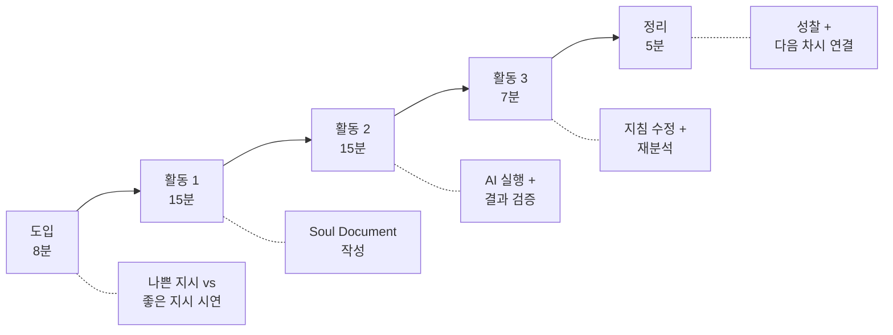
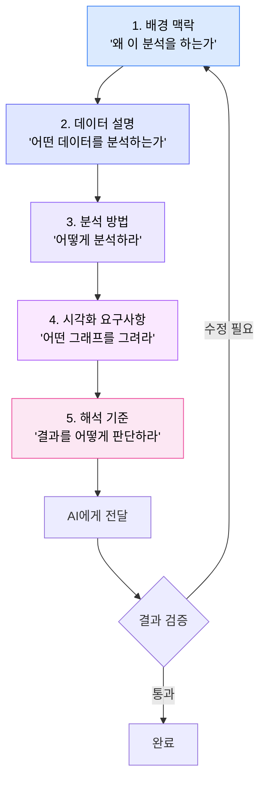

# Ch.4 --- 2차시 지도안: 좋은 지시가 좋은 분석을 만든다

**Part 2: AI에게 분석을 시켜라 | 2시간 (실제 수업 50분 + 교사 준비/심화)**

---

## 수업 개요

| 항목 | 내용 |
|------|------|
| **과목** | 정보 / 수학(통계) / 융합 |
| **차시** | 2/4차시 |
| **시간** | 50분 |
| **수업 형태** | 컴퓨터실 (개인 또는 2인 1조) |
| **모둠 구성** | 2인 1조 (짝 활동) 또는 개인 |
| **준비물** | 컴퓨터, AI 도구 접속, 학교 데이터셋, Soul Document 양식, 검증 체크리스트 |
| **선수 학습** | 1차시에서 완성한 데이터 질문 (3단 변환 결과) |
| **핵심 질문** | "AI에게 어떻게 시켜야 좋은 분석이 나올까?" |

!!! warning "사전 확인 필수"
    - AI 도구(Claude, ChatGPT 등) 접속이 학교 네트워크에서 가능한지 확인
    - 학교 데이터셋 파일이 학생 컴퓨터에 배포되었는지 확인
    - AI 도구 계정 로그인이 원활한지 사전 테스트

---

## 핵심 전환: 이 수업의 패러다임

기존 데이터 수업

### "판다스/엑셀로 직접 분석"

- 학생이 코드를 작성하거나 함수를 입력
- 도구 조작법 학습에 시간 소모
- "이 코드 왜 오류 나요?" 질문 반복
- **사고보다 기술에 집중**

이 수업

### "AI에게 분석을 지시 + 결과 검증"

- 학생이 분석 지침서(Soul Document)를 작성
- AI가 코드를 실행하고 결과를 생성
- "이 결과가 맞나?" 질문에 집중
- **기술보다 사고에 집중**

---

## 학습목표

!!! note "이 수업이 끝나면 학생은..."
    1. 분석 목적, 데이터, 방법, 시각화, 해석 기준을 포함한 **Soul Document**(분석 지침서)를 작성할 수 있다.
    2. Soul Document를 AI에게 전달하여 **분석을 실행**하고, 결과를 받을 수 있다.
    3. AI가 생성한 분석 결과를 **검증 체크리스트**를 활용하여 비판적으로 검토할 수 있다.

---

## 50분 타임라인

---

## 도입: 8분 --- "AI한테 시키면 끝 아닌가요?"

### 시연: 나쁜 지시 vs 좋은 지시

교사가 화면을 공유하며 같은 데이터를 두 가지 방식으로 AI에게 분석 요청합니다.

같은 데이터, 다른 지시 --- 결과가 이렇게 달라집니다

<iframe src="../demos/ch04_bad_vs_good.html"></iframe>

### 나쁜 지시 (30초 시연)

> **교사 → AI**: "이 데이터 분석해줘"

결과: 의미 불명의 그래프, 맥락 없는 통계량, 엉뚱한 결론

### 좋은 지시 (30초 시연)

> **교사 → AI**: "이 데이터는 200명 학생의 설문 결과입니다. 학년별 평균 수면시간에 차이가 있는지 분석하세요. 박스플롯과 ANOVA 검정을 사용하고, p-value를 포함하여 해석하세요."

결과: 깔끔한 시각화, 명확한 통계 결과, 근거 있는 해석

### 교사 발문

> **교사**: "똑같은 데이터인데 결과가 왜 이렇게 다를까요?"

| 예상 학생 반응 | 교사 대응 |
|--------------|----------|
| "자세하게 시켜서요" | "맞아요! 그런데 '자세하게'가 구체적으로 뭘 의미하는지 오늘 배울 거예요." |
| "뭘 분석하라고 했으니까요" | "좋아요! 분석 방법을 지정한 거죠. 그게 핵심이에요." |
| "그래프를 어떻게 그리라고 했어요" | "맞아요! 시각화 요구사항을 넣었죠. 안 넣으면 AI가 아무 그래프나 그려요." |

> **교사**: "오늘 여러분은 이런 **좋은 지시서**를 만들 거예요. 이름을 붙여줬는데, **Soul Document**라고 합니다. 분석의 영혼을 담은 문서라는 뜻이에요."

---

## 활동 1: 15분 --- Soul Document 작성

### Soul Document란?

!!! tip "Soul Document = 분석의 영혼을 담은 지침서"
    AI에게 분석을 시키기 전에 작성하는 **구조화된 지시 문서**입니다.
    이 문서에 분석의 목적, 데이터 설명, 분석 방법, 시각화 요구사항, 해석 기준을 모두 포함합니다.
    Soul Document의 질이 곧 분석 결과의 질을 결정합니다.

### Soul Document 작성 워크플로우

### 5대 구성요소

#### Step 1: 배경 맥락 --- "왜 이 분석을 하는가"

AI에게 분석의 배경과 목적을 설명합니다. 맥락 없이 데이터만 던지면 AI는 방향을 잡지 못합니다.

**작성 예시**:
> "이 분석은 우리 학교 학생들의 수면 패턴을 파악하기 위한 것입니다. 특히 학년에 따라 수면시간에 차이가 있는지 확인하여, 학년별 맞춤 수면 교육 프로그램의 필요성을 판단하고자 합니다."

!!! warning "흔한 실수"
    "데이터 분석해줘" --- 배경도 목적도 없는 지시. AI가 무엇을 찾아야 할지 모릅니다.

#### Step 2: 데이터 설명 --- "어떤 데이터를 분석하는가"

데이터의 구조, 변수, 규모를 설명합니다.

**작성 예시**:
> "데이터는 200명 학생의 설문 결과입니다. 주요 변수: 학년(1/2/3학년), 평일 평균 수면시간(시간), 주말 평균 수면시간(시간), 피로도(1~5점), 스트레스 지수(1~10점). CSV 파일로 첨부합니다."

#### Step 3: 분석 방법 --- "어떻게 분석하라"

구체적인 분석 방법을 지정합니다.

**작성 예시**:
> "1) 학년별 기술통계(평균, 표준편차, 중앙값)를 계산하세요. 2) 학년 간 수면시간 차이를 ANOVA(일원분산분석)로 검정하세요. 3) 유의수준 0.05에서 p-value를 보고하세요."

#### Step 4: 시각화 요구사항 --- "어떤 그래프를 그려라"

원하는 시각화 유형과 세부사항을 지정합니다.

**작성 예시**:
> "1) 학년별 수면시간 박스플롯을 그리세요. 2) x축 라벨: '학년', y축 라벨: '평균 수면시간(h)'. 3) 색상은 학년별로 구분하세요. 4) 그래프 제목: '학년별 평일 수면시간 분포'."

#### Step 5: 해석 기준 --- "결과를 어떤 기준으로 판단하라"

AI가 결과를 해석할 때의 기준을 제시합니다.

**작성 예시**:
> "1) p-value < 0.05이면 학년 간 차이가 통계적으로 유의하다고 판단합니다. 2) 평균 차이가 30분 이상이면 실질적으로 의미 있는 차이로 봅니다. 3) 결론을 한 문단으로 요약하세요."

### 데이터 소개

수업에서 사용할 학교 데이터셋 미리보기

<iframe src="../demos/data_preview_school.html"></iframe>

!!! note "데이터셋 안내"
    - **school_survey.csv**: 200명 학생 설문 결과 (학년, 수면시간, 피로도, 스트레스, 만족도 등)
    - 실제 데이터가 아닌 교육용 시뮬레이션 데이터입니다
    - 현실적 패턴을 반영하여 의미 있는 분석이 가능하도록 설계되었습니다

---

## 활동 2: 15분 --- AI 실행 + 결과 검증

### 활동 흐름

1. **Soul Document를 AI에게 전달** (3분): 작성한 문서를 복사하여 AI 대화창에 입력
2. **AI 분석 실행 대기** (2분): AI가 코드를 생성하고 결과를 반환
3. **결과 검증** (10분): 검증 체크리스트를 사용하여 결과를 비판적으로 검토

### 교사 발문: 실행 전

> **교사**: "지금부터 AI에게 Soul Document를 줄 거예요. 그런데 주의할 점! AI가 준 결과를 **그냥 믿으면 안 됩니다.** 여러분은 AI의 상사예요. 부하직원이 보고서를 가져오면 '정말?' 하고 확인하잖아요. 그것처럼 AI의 결과도 **검증**해야 합니다."

### 결과 검증 체크리스트

**AI 분석 결과 검증 체크리스트**

**1. 데이터 확인**

- [ ] AI가 사용한 데이터 크기가 원본과 일치하는가? (예: 200명)
- [ ] 결측값 처리 방법이 명시되어 있는가?
- [ ] 변수명이 올바르게 인식되었는가?

**2. 분석 방법 확인**

- [ ] 내가 지시한 분석 방법(예: ANOVA)을 사용했는가?
- [ ] 분석 방법이 데이터 유형에 적합한가?
- [ ] 통계량(p-value 등)이 보고되었는가?

**3. 시각화 확인**

- [ ] 내가 요청한 그래프 유형이 맞는가?
- [ ] 축 라벨, 제목, 범례가 포함되어 있는가?
- [ ] 그래프가 질문에 대한 답을 보여주는가?

**4. 해석 확인**

- [ ] 결론이 통계 결과와 일치하는가?
- [ ] 상관관계를 인과관계로 착각하지 않았는가?
- [ ] 한계점이나 주의사항이 언급되어 있는가?

**5. 상식 확인**

- [ ] 결과가 상식적으로 납득되는가?
- [ ] 극단적인 수치가 있다면 설명이 되는가?

### 교사 발문: 실행 후

| 상황 | 교사 발문 |
|------|----------|
| 결과가 잘 나온 경우 | "좋아요! 그런데 이 평균값이 정말 맞는지 어떻게 확인할 수 있을까요?" |
| 결과가 이상한 경우 | "뭔가 이상하죠? Soul Document의 어느 부분을 고치면 좋을까요?" |
| AI가 오류를 낸 경우 | "AI도 실수해요! 어떤 지시가 불분명해서 이런 결과가 나왔을까요?" |
| 검증을 안 하는 경우 | "체크리스트 첫 번째 항목부터 확인해 볼까요? AI가 데이터를 몇 개 읽었대요?" |

---

## 활동 3: 7분 --- 지침 수정 + 재분석

### 활동 설명

검증 과정에서 발견한 문제를 바탕으로 Soul Document를 수정하고, AI에게 다시 분석을 요청합니다.

> **교사**: "검증 결과 문제가 있었나요? Soul Document를 고쳐서 다시 시켜봅시다. 이 과정이 진짜 데이터 분석이에요. 한 번에 완벽한 결과가 나오는 법은 없어요."

!!! tip "수정-재분석 사이클의 교육적 가치"
    이 단계가 가장 중요한 학습 순간입니다.

    - **지시의 질 ↔ 결과의 질** 관계를 체감합니다
    - "어디를 어떻게 고치면 결과가 나아지는가"를 경험합니다
    - 반복적 개선(iteration)이 분석의 본질임을 배웁니다

### 흔한 수정 패턴

| 문제 | Soul Document 수정 방향 |
|------|----------------------|
| 그래프 라벨이 영어로 나옴 | 시각화 요구사항에 "모든 라벨을 한국어로" 추가 |
| 결측값 때문에 결과 왜곡 | 데이터 설명에 "결측값은 제거하고 분석" 추가 |
| 분석 방법이 부적절 | 분석 방법을 데이터 유형에 맞게 변경 |
| 해석이 너무 간단 | 해석 기준에 "구체적 수치를 인용하여 해석" 추가 |

---

## 정리: 5분 --- 성찰

### 오늘의 핵심 정리

> **교사**: "오늘 배운 것을 한마디로 하면: **좋은 지시가 좋은 분석을 만든다.** AI는 시키는 대로 합니다. 잘 시키면 잘 하고, 대충 시키면 대충 합니다. 여러분이 오늘 만든 Soul Document가 바로 '잘 시키는 기술'이에요."

### 성찰 질문 (짝과 30초씩 공유)

1. "Soul Document에서 가장 작성하기 어려웠던 섹션은?"
2. "검증 체크리스트에서 가장 놀라웠던 발견은?"
3. "다시 작성한다면 어디를 바꾸고 싶은가?"

---

## 형성평가 기준

| 평가 요소 | 수준 3 (우수) | 수준 2 (보통) | 수준 1 (노력 필요) |
|----------|-------------|-------------|------------------|
| **Soul Document 완성도** | 5개 섹션을 모두 구체적으로 작성 | 3~4개 섹션 작성, 일부 추상적 | 1~2개 섹션만 작성 |
| **AI 실행** | 실행 성공 + 의미 있는 결과 도출 | 실행 성공 + 결과 해석 미흡 | 실행 실패 또는 미시도 |
| **결과 검증** | 체크리스트 전 항목 확인 + 문제점 발견 | 체크리스트 일부 확인 | 검증 시도하지 않음 |
| **수정-재분석** | 문제점 기반 수정 → 개선된 결과 | 수정 시도했으나 개선 미미 | 수정 미시도 |

---

## 교사를 위한 심화 안내

??? question "학생이 AI 없이 직접 코딩하고 싶다고 하면?"
    허용하되, Soul Document는 반드시 먼저 작성하도록 합니다.
    "코딩하기 전에 뭘 코딩할지 먼저 계획하는 거잖아?"라고 안내하세요.
    실제로 Soul Document를 먼저 쓰면 코딩도 더 효율적으로 할 수 있습니다.

??? question "AI가 코드를 보여주면 학생이 코드에 집중하려고 해요"
    "코드는 AI가 쓰는 메모예요. 여러분은 **결과**를 봐야 해요."라고 안내합니다.
    코드를 이해하는 것은 보너스이지, 이 수업의 목표가 아닙니다.
    코드에 관심이 많은 학생에게는 심화 활동으로 "코드를 읽어보는 시간"을 별도로 제공할 수 있습니다.

??? question "모든 학생이 같은 분석을 하면 재미없지 않나요?"
    1차시에서 각자 다른 질문을 만들었기 때문에, 같은 데이터라도 **분석 방향이 다릅니다.**
    학년별 수면시간을 분석하는 학생, 스트레스와 만족도의 관계를 분석하는 학생 등
    질문이 다르면 결과도 다릅니다.

---

## 차시 연결

> **교사**: "오늘 여러분은 AI에게 분석을 시키고 결과를 검증했어요. 그런데 여러분 스스로 검증한 것만으로 충분할까요? 다음 시간에는 **짝의 분석을 뜯어볼 거예요.** 내가 놓친 문제를 짝이 찾아줄 수도 있거든요. 이걸 **피어리뷰**라고 합니다."

!!! abstract "다음 장 미리보기"
    **Ch.5 --- 분석 지침서(Soul Document) 작성 가이드**

    Soul Document의 5개 섹션을 깊이 있게 다룹니다. 섹션별 좋은 예시와 나쁜 예시, 데이터 유형별 분석 방법 매칭, 인터랙티브 차트 체험을 통해 학생의 작성 역량을 높입니다.
