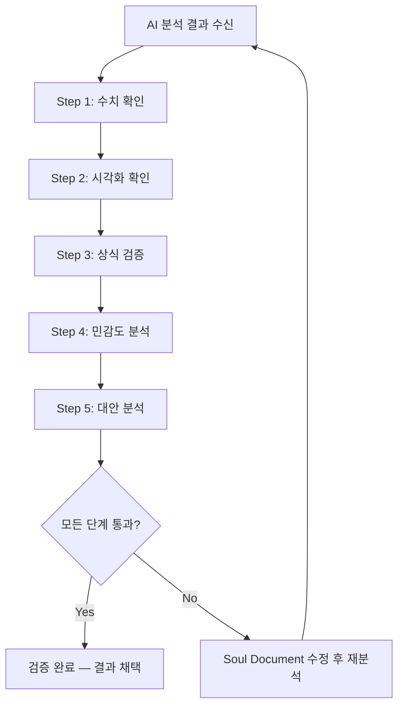
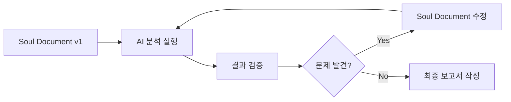

# Ch.6 — 결과 검증과 지침서 개선

Part 2

## AI에게 분석을 시켜라

결과를 받았다고 끝이 아닙니다. 검증하지 않은 분석은 위험합니다. | 2시간

---

## 왜 검증이 중요한가

!!! warning "AI는 자신 있게 틀린다"
    AI는 잘못된 결과를 낼 때도 마치 정확한 것처럼 제시합니다.
    숫자를 지어내고, 존재하지 않는 패턴을 발견하고, 논리적으로 보이는 오류를 생산합니다.
    **결과를 검증하는 것은 선택이 아니라 의무입니다.**

AI가 틀릴 수 있는 대표적인 사례를 살펴보겠습니다.

### 사례 1: 환각(Hallucination) — 없는 데이터를 만들어낸다

> "2023년 서울시 고등학생 평균 수면시간은 6.2시간이며, 이는 OECD 평균 7.8시간보다..."

이 문장에서 6.2시간이라는 수치는 AI가 만들어낸 것일 수 있습니다. 실제 데이터와 대조하지 않으면 가짜 근거 위에 결론을 세우는 꼴이 됩니다.

### 사례 2: 상관과 인과의 혼동

> "아이스크림 판매량이 증가하면 익사 사고도 증가한다. 따라서 아이스크림이 익사의 원인이다."

AI는 상관관계를 인과관계로 바꿔 해석하는 실수를 자주 합니다. 기온이라는 제3의 변수(교란 변수)를 놓치는 것입니다.

### 사례 3: 이상치 무시

> "우리 반 평균 용돈은 월 120만 원입니다."

30명 중 1명이 부모님 사업체에서 월 3,000만 원을 받는다면? 평균은 완전히 왜곡됩니다. AI는 이상치를 자동으로 처리하지 않을 때가 많습니다.

!!! note "핵심 메시지"
    AI의 결과를 무조건 신뢰하는 학생은 **AI의 실수를 자기 실수로 만드는 것**입니다.
    검증 능력이야말로 AI 시대에 가장 중요한 역량입니다.

---

## 5단계 검증 프로세스

아래 플로우차트는 AI 분석 결과를 체계적으로 검증하는 5단계 과정입니다.

각 단계를 자세히 살펴봅시다.

1

#### 수치 확인 — 합계, 평균, 범위가 상식적인가?

AI가 제시한 기초 통계량을 직접 확인합니다. 표본 크기가 맞는지, 합계가 부분의 합과 일치하는지, 평균이 범위 안에 있는지 점검합니다. 엑셀이나 계산기로 핵심 수치 2~3개만 직접 계산해 보면 됩니다.

**체크 포인트**: N(표본 수)가 원래 데이터와 일치하는가? 백분율의 합이 100%인가? 최솟값과 최댓값이 현실적인가?

2

#### 시각화 확인 — 그래프가 데이터를 정확히 반영하는가?

차트의 축 범위, 레이블, 색상 구분이 적절한지 확인합니다. Y축이 0에서 시작하는지, 범례가 데이터와 일치하는지, 그래프 유형이 데이터 성격에 맞는지 살핍니다.

**체크 포인트**: 축 제목이 변수를 정확히 설명하는가? 그래프에서 읽은 값이 데이터 테이블과 일치하는가? 시각적으로 과장하거나 축소하는 부분은 없는가?

3

#### 상식 검증 — 현실에서 가능한 결과인가?

"학생이 하루 25시간 스마트폰을 사용한다"거나 "만족도가 -3점"이라는 결과가 나오면 데이터 자체에 오류가 있는 것입니다. 분석 결과를 일상 경험과 대조해 봅니다.

**체크 포인트**: 이 수치가 현실적으로 가능한가? "이상하다"는 직감이 드는 부분은 없는가? 비교 대상(전국 평균, 지난해 수치 등)과 크게 괴리되지 않는가?

4

#### 민감도 분석 — 이상치 제거 시 결과가 바뀌는가?

극단값 1~2개를 제거하고 다시 분석해 봅니다. 결과가 크게 바뀐다면 그 결론은 소수의 이상치에 의존하는 불안정한 것입니다. 중앙값과 평균의 차이도 확인합니다.

**체크 포인트**: 상위/하위 5% 데이터를 제거하면 결론이 달라지는가? 평균과 중앙값의 차이가 큰가? 특정 데이터 포인트가 결과를 지배하고 있지 않은가?

5

#### 대안 분석 — 다른 방법으로 분석하면 같은 결론인가?

같은 데이터를 다른 시각화, 다른 통계 방법으로 분석해 봅니다. 막대그래프 대신 박스플롯을, 평균 대신 중앙값을, 상관분석 대신 그룹 비교를 시도합니다. 다양한 방법이 같은 결론을 가리키면 그 결론은 견고합니다.

**체크 포인트**: 다른 그래프 유형으로도 같은 패턴이 보이는가? 다른 통계 지표로도 같은 결론이 나오는가? AI에게 "반대 가설을 검증해 봐"라고 요청하면 어떤 결과가 나오는가?

---

## Plotly 데모로 체험하기

직접 인터랙티브 차트를 조작하며 검증의 감각을 익혀 봅시다.

### 데모 1: 추세 분석 — 서울 8월 기온 10년 추세

시계열 데이터에서 추세를 읽을 때 주의할 점을 체험합니다. 추세선의 기울기가 출발점에 따라 어떻게 달라지는지 확인해 보세요.

서울 8월 기온 10년 추세 — 추세선의 시작점을 바꿔 보세요

<iframe src="../demos/ch06_trend_analysis.html"></iframe>

!!! tip "교사 활용 포인트"
    "같은 데이터인데 기간을 다르게 잡으면 '기온 상승'으로도, '기온 정체'로도 해석할 수 있습니다."
    이것이 바로 **체리피킹(cherry-picking)** 문제입니다. 학생들에게 "내가 보고 싶은 결과만 골라서 보여주는 것"의 위험을 인식시킵니다.

### 데모 2: 그룹 비교 — 수면시간별 만족도 박스플롯

그룹 간 비교에서 평균만 보면 놓치는 것들을 체험합니다. 박스플롯은 분포의 형태, 이상치, 중앙값을 동시에 보여줍니다.

수면시간별 생활 만족도 — 박스플롯으로 분포까지 확인

<iframe src="../demos/ch06_group_comparison.html"></iframe>

!!! note "주목할 점"
    평균만 비교하면 "수면 많은 그룹이 만족도가 높다"로 끝나지만,
    박스플롯을 보면 그룹 내 **편차**가 매우 크다는 것을 알 수 있습니다.
    "6시간 수면 그룹에도 만족도 9점인 학생이 있다"는 사실이 중요합니다.

### 데모 3: 검증 전/후 비교 — 검증이 결과를 바꾼다

이상치를 포함한 분석과 제거 후 분석이 어떻게 다른 결론을 내는지 직접 확인합니다.

검증 전 vs 검증 후 — 이상치 제거가 결론을 바꾸는 순간

<iframe src="../demos/ch06_verification_demo.html"></iframe>

검증 전

### 이상치 포함 분석

- 상관계수 r = 0.72 (강한 양의 상관)
- "스마트폰 사용이 성적에 긍정적 영향"
- **결론이 이상치 2개에 의존**

검증 후

### 이상치 제거 분석

- 상관계수 r = -0.15 (약한 음의 상관)
- "유의미한 관계 없음"
- **현실에 부합하는 안정적 결론**

---

## 지침서 개선 반복 사이클

검증에서 문제가 발견되면 Soul Document를 수정하고 다시 분석합니다. 이 반복 과정이 바로 **에이전틱 러닝의 핵심**입니다.

### 반복의 실제 예시

| 반복 | Soul Document 변경 사항 | 결과 변화 |
|:---:|:---|:---|
| **v1 → v2** | "이상치를 확인하고 처리해 주세요" 추가 | 극단값 3개 제거, 평균 변화 |
| **v2 → v3** | "중앙값과 평균을 모두 보고해 주세요" 추가 | 분포 왜곡 확인 가능 |
| **v3 → v4** | "남녀별 분리 분석도 해 주세요" 추가 | 숨겨진 하위 그룹 패턴 발견 |

!!! tip "교사를 위한 포인트"
    학생들에게 **최소 2회 반복**을 요구하세요. 처음에는 억지로라도 문제를 찾게 하면,
    점차 "뭔가 이상하다"를 자연스럽게 감지하는 감각이 생깁니다.

---

## 검증 체크리스트

아래 10개 항목을 하나씩 점검합니다. 모두 통과해야 분석 결과를 채택할 수 있습니다.

<ul class="verification-checklist" markdown>
<li class="checked">표본 크기(N)가 원래 데이터와 일치하는가?</li>
<li class="checked">백분율의 합이 100% (또는 그에 가까운 값)인가?</li>
<li class="checked">평균, 중앙값, 최솟값, 최댓값이 현실적인 범위 안에 있는가?</li>
<li>시각화의 축 범위가 적절하고 레이블이 정확한가?</li>
<li>그래프에서 읽은 값과 데이터 테이블의 값이 일치하는가?</li>
<li>결과에 "상식적으로 불가능한" 수치가 포함되어 있지 않은가?</li>
<li>이상치를 제거해도 주요 결론이 유지되는가?</li>
<li>다른 분석 방법(다른 그래프, 다른 통계 지표)으로도 같은 결론이 나오는가?</li>
<li>상관관계를 인과관계로 해석하고 있지 않은가?</li>
<li>AI가 "만들어낸" 수치나 출처 불명의 데이터가 포함되어 있지 않은가?</li>
</ul>

!!! note "활용 방법"
    이 체크리스트를 인쇄하여 학생들에게 나눠 주거나, 디지털 양식으로 만들어 제출하게 할 수 있습니다.
    처음에는 교사가 함께 점검하고, 점차 학생 스스로 수행하도록 유도합니다.

---

## 흔한 AI 분석 오류 사례

!!! tip "오류 사례 1: 결측값을 0으로 처리"
    **상황**: 설문에서 "응답 안 함"을 AI가 0점으로 처리
    **결과**: 만족도 평균이 실제보다 크게 낮아짐 (예: 7.2 → 5.1)
    **해결**: Soul Document에 "결측값은 분석에서 제외하고, 결측 비율을 보고해 주세요"라고 명시

!!! tip "오류 사례 2: 범주형 변수를 수치로 계산"
    **상황**: 학년(1, 2, 3)을 연속형 수치로 취급하여 "평균 학년 2.1"을 산출
    **결과**: 의미 없는 통계량 생성, 회귀분석 오류
    **해결**: Soul Document에 "학년은 범주형 변수로 처리해 주세요. 그룹별 비교를 사용하세요"라고 명시

!!! tip "오류 사례 3: 소규모 표본에서 과잉 일반화"
    **상황**: 5명의 데이터로 "고등학생 전체의 경향"이라고 결론
    **결과**: 통계적 유의성이 없는 패턴을 확정적으로 서술
    **해결**: Soul Document에 "표본 크기의 한계를 명시하고, 일반화 범위를 제한해 주세요"라고 추가

---

## Soul Document 개선의 실제 흐름

Soul Document v1 (최초 버전)

분석 목적: 수면시간과 성적의 관계 분석

데이터: school_survey_200.csv

분석 방법: 상관분석, 산점도

출력 형식: 그래프 + 해석 문단

Soul Document v3 (검증 후 개선된 버전)

분석 목적: 수면시간과 성적의 관계 분석

데이터: school_survey_200.csv (결측값 제외 후 N 보고)

전처리: 이상치 식별(IQR 방법) → 제거 전후 결과 모두 보고 / 결측값 행 제외

분석 방법: ① 상관분석(피어슨) ② 박스플롯(그룹별) ③ 남녀 분리 분석

출력 형식: 그래프(축 라벨 필수) + 기초 통계표 + 해석 문단 + 한계 서술

주의사항: 상관관계를 인과관계로 해석하지 말 것. 표본 한계 명시할 것.

??? question "학생 활동: v1과 v3의 차이점을 찾아보세요"
    - **전처리 추가**: 이상치와 결측값 처리 명시
    - **분석 방법 다양화**: 1가지 → 3가지
    - **출력 형식 구체화**: 기초 통계표와 한계 서술 추가
    - **주의사항 추가**: 해석 오류 방지 지침

---

## 교사를 위한 팁: "검증할 게 없는데요?"

!!! warning "가장 흔한 학생 반응"
    "결과가 잘 나왔는데 뭘 검증해요?" 라는 반응이 나올 때 어떻게 해야 할까요?

### 대처 전략 1: 의도적 오류 심기

미리 준비한 "오류가 포함된 분석 결과"를 보여주고 찾게 합니다. 예를 들어:

- 합계가 110%인 원형 그래프
- Y축이 50에서 시작하는 막대그래프 (차이 과장)
- "응답자 200명" 데이터에서 "N=187"로 분석된 결과 (13명은 어디로?)

### 대처 전략 2: 짝과 교차 검증

"네 분석은 완벽해 보여? 그럼 옆 친구 분석을 봐 봐."
남의 분석에서는 문제가 잘 보입니다. 그 눈을 자기 분석에 돌리는 훈련입니다.

### 대처 전략 3: 역방향 질문

"AI한테 정반대 가설로 분석해 달라고 해 봐. 수면이 성적에 나쁜 영향을 준다는 가설로."
반대 결과가 나오면 원래 결론이 견고하지 않다는 뜻이고, 같은 결론이 나오면 더 확신할 수 있습니다.

??? success "기대 효과"
    이 전략들을 활용하면 학생들은 점차 **"이 결과가 정말 맞을까?"** 라는 질문을 스스로 던지게 됩니다.
    이것이 바로 **비판적 사고(critical thinking)** 의 시작점입니다.

---

## 수업 활동 요약

1

AI 분석 결과 수신

5분

2

5단계 검증 실행

25분

3

Soul Document 수정

10분

4

재분석 + 비교

10분

---

!!! abstract "이 챕터의 핵심"
    - AI 분석 결과는 **반드시 검증**해야 한다
    - 5단계 검증 프로세스를 체계적으로 적용한다
    - 검증에서 문제가 발견되면 **Soul Document를 개선**하고 재분석한다
    - 이 반복 과정 자체가 **진짜 분석 역량**을 키우는 학습이다

[← Ch.5 Soul Document 작성](chapter05.md){ .md-button } &nbsp; [Ch.7 피어리뷰 지도안 →](chapter07.md){ .md-button .md-button--primary }

