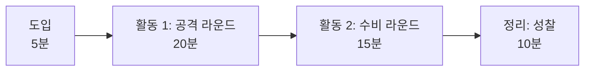
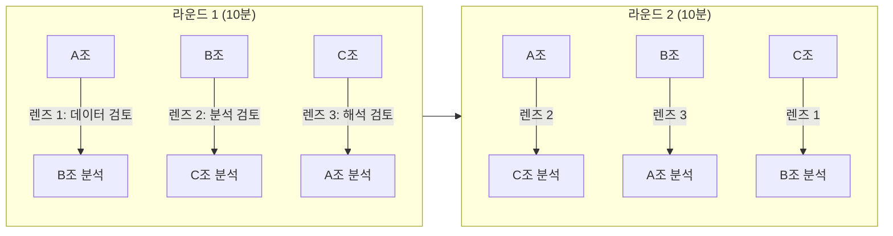
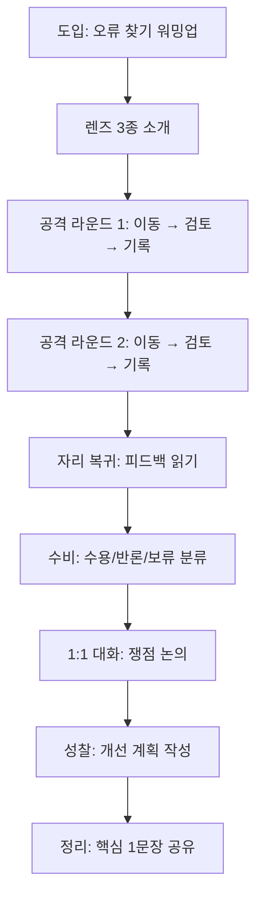

# Ch.7 — 3차시 지도안: 피어리뷰

Part 3

## 단짝 분석을 부숴라

자기 글의 오탈자는 안 보인다. 남의 분석을 볼 때 비판적 시선이 작동한다. | 2시간

---

## 수업 개요

| 항목 | 내용 |
|:---|:---|
| **차시** | 3차시 (전체 4차시 중) |
| **소요 시간** | 50분 |
| **수업 형태** | 2인 1조 → World Cafe 로테이션 |
| **필요 환경** | PC(또는 태블릿) + 인쇄된 피어리뷰 양식 |
| **선수 학습** | 1~2차시: 질문 설계 → 분석 지침서(Soul Document) → AI 분석 → 결과 검증 완료 |
| **핵심 활동** | 공격 라운드(남의 분석 부수기) + 수비 라운드(내 분석 방어/수용) |
| **준비물** | 피어리뷰 기록 양식(Ch.8), 3색 포스트잇(렌즈별 색상 구분) |

---

## 핵심 아이디어

!!! abstract "왜 피어리뷰인가?"
    자기가 쓴 글에서 오탈자를 못 찾듯이, 자기 분석에서 오류를 찾기란 어렵습니다.
    **남의 분석을 볼 때 비로소 비판적 시선이 작동합니다.**

    피어리뷰는 단순한 "서로 봐주기"가 아닙니다.
    구조화된 렌즈(관점)를 가지고, 근거를 들어, 대안을 제시하는 **전문적 검토 활동**입니다.

### 피어리뷰가 가르치는 것

1. **비판적 읽기**: 결론이 아니라 근거를 보는 눈
2. **구체적 피드백**: "별로예요"가 아니라 "여기서 표본이 부족합니다"
3. **건설적 대안**: "틀렸어요"가 아니라 "이렇게 하면 어떨까요?"
4. **메타인지**: 남의 분석을 검토하며 자기 분석을 되돌아보는 힘

---

## 학습 목표

??? success "학습 목표 3가지"
    1. 3가지 검토 렌즈(데이터 정합성, 분석 논리, 해석 타당성)를 사용하여 동료의 분석을 **체계적으로 검토**할 수 있다.
    2. 구체적 근거와 대안을 포함한 **건설적 피드백**을 작성하고 전달할 수 있다.
    3. 받은 피드백을 분류(수용/반론)하고 **분석 개선 계획**을 수립할 수 있다.

---

## 50분 수업 타임라인

1

도입: 왜 남의 분석을 봐야 하는가

5분

2

공격 라운드: 남의 분석 부수기

20분

3

수비 라운드: 내 분석 방어 또는 수용

15분

4

정리: 성찰 + 개선 계획

10분

---

## 단계별 수업 진행

### 도입 (5분): 왜 남의 분석을 봐야 하는가

**교사 발문:**

> "여러분이 쓴 카톡 메시지에서 오타를 바로 발견하나요? 보통 보내고 나서야 보이죠.
> 분석도 마찬가지입니다. 자기가 만든 분석에는 '이게 맞겠지'라는 확증 편향이 작동합니다."

**활동:**

1. 간단한 워밍업: "오류가 숨겨진 분석 결과" 1개를 보여주고 30초 안에 오류 찾기
2. 찾은 학생에게 "어떻게 알았어?"를 물으며 **검토 관점**의 중요성 강조
3. 오늘의 목표 제시: "3가지 렌즈로 짝의 분석을 전문가처럼 검토합니다"

!!! tip "워밍업 예시 자료"
    - Y축이 50~100 범위인 막대그래프 (차이 과장)
    - "N=200"인데 그래프에 198개 점만 있는 산점도
    - "학생의 78%가 선호"인데 원형 그래프 합계가 105%

---

### 활동 1 (20분): 공격 라운드 — 남의 분석 부수기

World Cafe 방식으로 조별 로테이션하며 다른 조의 분석을 검토합니다.

#### 피어리뷰 로테이션 구조

!!! note "로테이션 규칙"
    - 각 라운드 10분 (2라운드 = 20분)
    - 한 조의 분석은 **2개 렌즈**로 검토받음 (2라운드 후)
    - 검토 내용은 **피어리뷰 기록 양식(Ch.8)**에 작성
    - 구두가 아닌 **서면 피드백** — "말은 사라지지만 글은 남는다"

#### 진행 방법

1. **교사**: 각 조에 검토 대상과 렌즈를 지정 (칠판에 배치도 게시)
2. **학생**: 해당 조의 노트북/화면으로 이동, 분석 결과를 읽고 양식에 기록
3. **교사**: 5분 경과 시 "핵심 발견 1개는 꼭 적으세요" 중간 안내
4. **교사**: 10분 후 "로테이션!" 신호 → 다음 라운드 이동

---

### 3가지 검토 렌즈

각 렌즈는 서로 다른 관점에서 분석을 검토합니다.

🔍

#### 렌즈 1: 데이터 정합성

데이터가 질문에 적합한가? 표본은 충분한가? 결측값과 이상치는 적절히 처리되었는가?

**핵심 질문**: "이 데이터로 이 질문에 답할 수 있는가?"

⚙️

#### 렌즈 2: 분석 논리

분석 방법이 데이터 유형에 적합한가? 통계적 오류는 없는가? 시각화는 데이터를 정확히 반영하는가?

**핵심 질문**: "분석 과정에 논리적 허점이 있는가?"

💡

#### 렌즈 3: 해석 타당성

결론이 데이터에서 실제로 도출되는가? 과잉 해석이나 과소 해석은 없는가? 한계를 인식하고 있는가?

**핵심 질문**: "이 결론이 정말 데이터가 말하는 것인가?"

#### 렌즈별 세부 검토 항목

| 렌즈 | 검토 항목 | 찾아야 할 문제 예시 |
|:---|:---|:---|
| **데이터** | 변수 적합성 | 만족도를 측정하면서 행복도 데이터를 사용 |
| **데이터** | 표본 크기 | 30명 미만으로 전체 학교를 대표한다고 주장 |
| **데이터** | 결측값 처리 | 결측값을 0으로 대체하여 평균 왜곡 |
| **분석** | 방법 적절성 | 범주형 데이터에 상관분석 적용 |
| **분석** | 이상치 처리 | 극단값 방치로 평균이 크게 왜곡 |
| **분석** | 시각화 정확성 | Y축 범위 조작으로 차이 과장 |
| **해석** | 근거 충분성 | 데이터 없이 "~일 것이다"로 추론 |
| **해석** | 일반화 범위 | "우리 반" 결과를 "한국 고등학생 전체"로 확대 |
| **해석** | 인과 혼동 | 상관관계를 인과관계로 서술 |

---

### 활동 2 (15분): 수비 라운드 — 내 분석 방어 또는 수용

검토 결과를 받아서 읽고, 각 피드백에 대해 **수용 또는 반론**을 결정합니다.

#### 진행 방법

1. **돌아오기** (2분): 자기 자리로 돌아와 받은 피어리뷰 양식을 읽음
2. **분류하기** (5분): 각 피드백을 아래 3가지로 분류

    | 분류 | 설명 | 행동 |
    |:---|:---|:---|
    | **수용** | "맞는 지적이다. 내가 놓쳤다." | 개선 계획에 반영 |
    | **반론** | "근거를 들어 반박할 수 있다." | 반론 근거 작성 |
    | **보류** | "추가 확인이 필요하다." | 재분석 후 판단 |

3. **대화하기** (5분): 검토해 준 조와 1:1 대화 — 쟁점 있는 피드백 논의
4. **개선 계획** (3분): 성찰지에 개선 계획 작성 (Ch.8 양식 활용)

!!! warning "교사 주의: 감정 관리"
    "부수기"라는 표현 때문에 공격적으로 흐를 수 있습니다.
    **규칙 1**: 사람이 아니라 분석을 검토한다
    **규칙 2**: "틀렸다"가 아니라 "이 부분이 궁금하다"로 표현
    **규칙 3**: 문제 제기에는 반드시 대안을 함께 제시

---

### 정리 (10분): 성찰

#### 교사 발문

> "오늘 남의 분석을 보면서 가장 크게 느낀 점은 무엇인가요?"

> "남의 분석에서 발견한 문제가 혹시 내 분석에도 있진 않았나요?"

#### 성찰 활동

1. **핵심 1문장 적기**: "오늘 피어리뷰에서 배운 가장 중요한 것 1가지"
2. **손들기 투표**: "받은 피드백 중 수용할 것이 1개 이상인 사람?" → 대부분이면 성공
3. **다음 차시 예고**: "다음 시간에는 오늘 배운 모든 것을 단계적 도움(스캐폴딩) 없이 혼자 합니다"

---

## 교사 발문 예시 + 예상 반응

| 교사 발문 | 예상 학생 반응 | 교사 후속 발문 |
|:---|:---|:---|
| "이 분석에서 제일 먼저 확인할 것은?" | "표본 수요" / "그래프요" | "좋아요. 구체적으로 어떤 숫자를 볼 건가요?" |
| "이 결론에 동의하나요?" | "네" / "아니요, 왜냐하면..." | "동의한다면, 반대 의견을 만들어 보세요" |
| "이 그래프가 정확할까요?" | "축이 이상해요" / "잘 모르겠어요" | "그래프의 숫자와 표의 숫자를 비교해 보세요" |
| "피드백을 줄 때 가장 중요한 것은?" | "구체적으로요" / "근거요" | "맞아요. '별로예요'는 피드백이 아닙니다" |
| "반론할 수 있는 피드백은 어떤 건가요?" | "잘못 이해한 거요" | "그럼 어떻게 설명하면 상대가 이해할까요?" |

---

## 피드백 전달 3원칙

!!! note "원칙 1: 구체적으로"
    **나쁜 예**: "분석이 좀 이상해요"
    **좋은 예**: "박스플롯에서 Q3 값이 데이터 범위를 넘어갑니다. 이상치 처리를 확인해 주세요."

!!! note "원칙 2: 근거와 함께"
    **나쁜 예**: "이 결론 틀린 것 같아요"
    **좋은 예**: "표본이 25명인데 '전체 학생의 경향'이라고 결론 내린 부분은 일반화 범위를 좁혀야 할 것 같습니다."

!!! note "원칙 3: 대안을 제시"
    **나쁜 예**: "막대그래프가 적절하지 않아요"
    **좋은 예**: "분포를 보여주려면 막대그래프 대신 박스플롯이 더 적합할 것 같습니다. 그러면 편차도 함께 보일 수 있습니다."

---

## 교사 주의사항

### 갈등 관리

??? warning "피드백으로 인한 갈등이 생겼을 때"
    1. **즉시 개입**: "좋은 토론이네요. 둘 다 근거가 있어요. 데이터로 확인해 봅시다."
    2. **인신 공격 차단**: "분석을 검토하는 거지, 사람을 평가하는 게 아닙니다."
    3. **중재 질문**: "두 분 다 맞을 수 있어요. 어떤 조건에서 A가 맞고, 어떤 조건에서 B가 맞을까요?"
    4. **마지막 수단**: 논쟁이 길어지면 "보류"로 분류하고 다음 시간에 데이터로 확인

### 시간 배분

??? tip "시간이 부족할 때"
    - **공격 라운드 단축**: 2라운드 → 1라운드 (10분 절약)
    - **성찰 간소화**: 손들기 투표만 실시 (5분 절약)
    - **핵심 유지**: 공격 라운드는 절대 줄이지 말고, 수비 라운드에서 시간 조절

### 소극적 학생 지원

??? question "피드백을 못 쓰겠다는 학생에게"
    1. **체크리스트 제공**: Ch.8의 렌즈별 검토 항목을 하나씩 체크하게 함
    2. **질문 전환**: "틀린 점을 찾아라"가 아니라 "궁금한 점 1개만 적어라"
    3. **모범 피드백 예시**: 칠판에 좋은 피드백 예시를 게시
    4. **짝 활동**: 혼자 쓰기 어려운 학생은 짝과 함께 토의 후 작성

---

## 수업 흐름 전체 Mermaid

---

## 다음 차시 연결

!!! abstract "3차시 → 4차시 브릿지"
    오늘 피어리뷰에서 발견한 문제점과 받은 피드백을 바탕으로,
    **다음 차시에는 처음부터 끝까지 혼자** 전체 분석 파이프라인을 수행합니다.

    지금까지 배운 것:

    - [x] 1차시: 질문 설계 (3단 변환)
    - [x] 2차시: Soul Document + AI 분석 + 결과 검증
    - [x] 3차시: 피어리뷰 (비판적 검토)
    - [ ] **4차시: 독립 프로젝트** ← 다음 시간

    피어리뷰에서 배운 "남의 분석 보는 눈"을 **자기 분석에 적용**하는 것이 4차시의 핵심입니다.

---

!!! abstract "이 챕터의 핵심"
    - 피어리뷰는 "서로 봐주기"가 아니라 **구조화된 전문적 검토**이다
    - 3가지 렌즈(데이터, 분석, 해석)로 체계적으로 검토한다
    - 피드백은 **구체적으로, 근거와 함께, 대안을 제시**하며 전달한다
    - 받은 피드백을 **수용/반론/보류로 분류**하고 개선 계획을 세운다

[← Ch.6 결과 검증](chapter06.md){ .md-button } &nbsp; [Ch.8 피어리뷰 양식 →](chapter08.md){ .md-button .md-button--primary }

