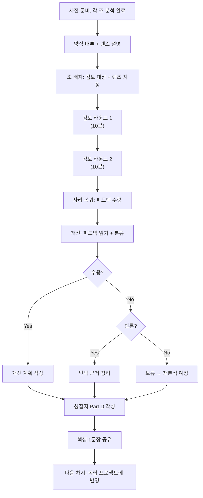

# Ch.8 — 피어리뷰 양식·루브릭·성찰지

Part 3

## 서로의 분석을 검증하라 — 수업 자료

3차시 피어리뷰에서 사용하는 기록 양식, 평가 루브릭, 성찰지를 모두 담았습니다. | 50분

---

## 피어리뷰 기록 양식

!!! note "사용 안내"
    이 양식은 **검토자(검토 라운드)**가 작성합니다.
    렌즈별로 해당 항목을 점검하고, 발견한 문제와 제안을 구체적으로 기록하세요.

### 렌즈 1: 데이터 정합성

> **핵심 질문**: "이 데이터로 이 질문에 답할 수 있는가?"

| 검토 항목 | 점검 내용 | 결과 (O/X/△) | 발견 사항 |
|:---|:---|:---:|:---|
| **변수 적합성** | 분석 질문에 답하기 위한 변수가 데이터에 포함되어 있는가? | | |
| **변수 유형** | 각 변수의 유형(연속형/범주형)이 올바르게 구분되어 있는가? | | |
| **표본 크기** | 결론을 내리기에 충분한 표본 수(N)인가? | | |
| **표본 대표성** | 표본이 모집단을 합리적으로 대표하는가? | | |
| **결측값 처리** | 결측값의 비율과 처리 방법이 명시되어 있는가? | | |
| **결측값 영향** | 결측값 처리 방법이 결과에 편향을 주지 않는가? | | |
| **데이터 출처** | 데이터의 출처와 수집 방법이 명시되어 있는가? | | |

**렌즈 1 종합 의견:**

> (발견된 핵심 문제와 개선 제안을 구체적으로 작성하세요)

---

### 렌즈 2: 분석 논리

> **핵심 질문**: "분석 과정에 논리적 허점이 있는가?"

| 검토 항목 | 점검 내용 | 결과 (O/X/△) | 발견 사항 |
|:---|:---|:---:|:---|
| **방법 적절성** | 분석 방법(상관/비교/추세 등)이 질문과 데이터 유형에 맞는가? | | |
| **이상치 처리** | 이상치를 식별하고 적절히 처리했는가? | | |
| **전처리 기록** | 데이터 전처리 과정이 투명하게 기록되어 있는가? | | |
| **시각화 정확성** | 그래프 유형이 데이터 성격에 적합한가? | | |
| **축 설정** | 축 범위, 레이블, 단위가 정확하고 적절한가? | | |
| **통계적 유의성** | 표본 크기 대비 적절한 수준의 통계적 판단을 하고 있는가? | | |
| **복수 분석** | 하나의 방법만이 아닌, 다각도 분석을 시도했는가? | | |

**렌즈 2 종합 의견:**

> (발견된 핵심 문제와 개선 제안을 구체적으로 작성하세요)

---

### 렌즈 3: 해석 타당성

> **핵심 질문**: "이 결론이 정말 데이터가 말하는 것인가?"

| 검토 항목 | 점검 내용 | 결과 (O/X/△) | 발견 사항 |
|:---|:---|:---:|:---|
| **근거 충분성** | 모든 결론이 데이터와 분석 결과에 근거하고 있는가? | | |
| **과잉 해석** | 데이터가 지지하지 않는 범위까지 결론을 확장하지 않았는가? | | |
| **인과 혼동** | 상관관계를 인과관계로 잘못 해석하고 있지 않은가? | | |
| **일반화 범위** | 결론의 적용 범위를 적절하게 제한하고 있는가? | | |
| **대안 해석** | 다른 가능한 해석을 고려했는가? | | |
| **한계 인식** | 분석의 한계점을 명시적으로 인정하고 있는가? | | |
| **교란 변수** | 제3의 변수(교란 변수)의 가능성을 고려했는가? | | |

**렌즈 3 종합 의견:**

> (발견된 핵심 문제와 개선 제안을 구체적으로 작성하세요)

---

## 피어리뷰 평가 시각화

아래 레이더 차트는 검토 결과를 시각적으로 보여줍니다. 어떤 렌즈에서 강점이 있고 어떤 렌즈에서 보완이 필요한지 한눈에 파악할 수 있습니다.

피어리뷰 결과 레이더 차트 — 렌즈별 점수 분포

<iframe src="../demos/ch08_peer_review_viz.html"></iframe>

!!! tip "레이더 차트 활용법"
    - 6각형이 고르게 넓으면: 전반적으로 우수한 분석
    - 한쪽이 움푹 들어가면: 해당 영역에 집중 보완 필요
    - 학생들에게 "어떤 꼭짓점을 키우고 싶은지" 목표를 설정하게 하세요

---

## 피어리뷰 루브릭

검토자의 피어리뷰 활동 자체를 평가하는 루브릭입니다. "좋은 피드백"이란 무엇인지 기준을 제시합니다.

<table class="rubric-table">
<thead>
<tr>
<th>평가 기준</th>
<th>탁월 (4)</th>
<th>우수 (3)</th>
<th>보통 (2)</th>
<th>미흡 (1)</th>
</tr>
</thead>
<tbody>
<tr>
<td><strong>피드백 구체성</strong></td>
<td>구체적인 위치(페이지, 그래프, 수치)를 지정하여 문제를 정확히 짚음</td>
<td>대부분의 피드백에 구체적 근거가 있으나, 일부 모호한 표현 포함</td>
<td>피드백이 있으나 "좀 이상하다" 수준의 추상적 표현이 많음</td>
<td>피드백이 거의 없거나, "좋아요/별로예요" 수준</td>
</tr>
<tr>
<td><strong>근거 제시</strong></td>
<td>모든 지적에 데이터, 수치, 논리적 이유를 명확히 제시</td>
<td>대부분의 지적에 근거를 제시하나, 1~2개는 근거 없이 직감적</td>
<td>일부 지적에만 근거 제시, 나머지는 감상적 판단</td>
<td>근거 없이 "느낌"으로만 피드백</td>
</tr>
<tr>
<td><strong>대안 제시</strong></td>
<td>문제마다 실현 가능한 구체적 개선 방안을 제시</td>
<td>주요 문제에 대안을 제시하나, 구체성이 다소 부족</td>
<td>문제를 지적하지만 "어떻게 고칠지"는 제시하지 않음</td>
<td>문제 지적도 없고 대안도 없음</td>
</tr>
<tr>
<td><strong>존중적 표현</strong></td>
<td>분석을 검토 대상으로 삼으며, 건설적이고 예의 바른 표현 사용</td>
<td>대체로 존중적이나, 간혹 직설적/날카로운 표현 포함</td>
<td>피드백 의도는 있으나 표현이 무례하거나 비꼬는 어조</td>
<td>인신공격, 무시, 비하 등 부적절한 표현 사용</td>
</tr>
<tr>
<td><strong>렌즈 활용</strong></td>
<td>지정된 렌즈의 모든 항목을 빠짐없이 체계적으로 검토</td>
<td>렌즈 항목의 70% 이상을 검토하고 기록</td>
<td>렌즈 항목의 50% 정도만 형식적으로 체크</td>
<td>렌즈를 무시하고 자유 형식으로만 작성</td>
</tr>
</tbody>
</table>

!!! note "채점 기준"
    - **16~20점 (탁월)**: 전문 리뷰어 수준의 피드백
    - **12~15점 (우수)**: 팀에 실질적 도움이 되는 피드백
    - **8~11점 (보통)**: 기본적 검토는 했으나 깊이 부족
    - **5~7점 (미흡)**: 피어리뷰의 목적을 달성하지 못함

---

## 분석 개선 성찰지

!!! note "사용 안내"
    이 양식은 **피검토자(개선 라운드)**가 작성합니다.
    받은 피드백을 읽고, 수용/반론을 결정하고, 개선 계획을 세웁니다.

### Part A: 받은 피드백 정리

| 순번 | 피드백 내용 요약 | 렌즈 | 분류 |
|:---:|:---|:---:|:---:|
| 1 | | 데이터 / 분석 / 해석 | 수용 / 반론 / 보류 |
| 2 | | 데이터 / 분석 / 해석 | 수용 / 반론 / 보류 |
| 3 | | 데이터 / 분석 / 해석 | 수용 / 반론 / 보류 |
| 4 | | 데이터 / 분석 / 해석 | 수용 / 반론 / 보류 |
| 5 | | 데이터 / 분석 / 해석 | 수용 / 반론 / 보류 |

### Part B: 핵심 피드백 분석

**가장 핵심적인 피드백 1가지:**

> (받은 피드백 중 분석에 가장 큰 영향을 미치는 것을 골라 작성하세요)

**이 피드백에 대한 나의 판단:**

- [ ] **수용**: 이 지적이 맞다. 내가 놓친 부분이다.
- [ ] **반론**: 이 지적에 반박할 근거가 있다. (아래에 근거 작성)
- [ ] **보류**: 추가 확인이 필요하다. (재분석 방법 기술)

**수용 시 — 어떻게 개선할 것인가:**

> (구체적 개선 방법을 작성하세요. 예: "분석 지침서(Soul Document)에 이상치 처리 조건을 추가한다")

**반론 시 — 반박 근거:**

> (데이터나 논리에 기반한 반박 근거를 작성하세요)

### Part C: 개선 계획

| 개선 항목 | 현재 상태 | 개선 후 목표 | 수정할 Soul Document 부분 |
|:---|:---|:---|:---|
| | | | |
| | | | |
| | | | |

### Part D: 메타인지 성찰

??? question "성찰 질문 — 솔직하게 답해 보세요"
    1. 피어리뷰 전에 내 분석이 완벽하다고 생각했는가? (1: 전혀 ~ 5: 매우)
    2. 피어리뷰 후 내 분석에 대한 확신이 바뀌었는가? 어떻게?
    3. 남의 분석을 검토하면서 **내 분석에서도 같은 문제**를 발견했는가?
    4. 다음에 분석할 때 가장 먼저 주의할 점은 무엇인가?

---

## 교사 커스터마이징 가이드

!!! tip "상황에 맞게 양식을 조절하세요"

### 난이도 조절

| 수준 | 렌즈 | 검토 항목 수 | 비고 |
|:---|:---|:---:|:---|
| **기초** | 렌즈 1개 (데이터만) | 렌즈당 3개 | 첫 피어리뷰 경험 학생 |
| **보통** | 렌즈 2개 (데이터+해석) | 렌즈당 5개 | 기본 피어리뷰 경험 있는 학생 |
| **심화** | 렌즈 3개 (전체) | 렌즈당 7개 | 데이터 분석 경험이 풍부한 학생 |

### 시간 조절

| 활동 | 50분 수업 | 40분 수업 | 30분 수업 (약식) |
|:---|:---:|:---:|:---:|
| 도입 | 5분 | 3분 | 2분 |
| 검토 라운드 | 20분 (2회전) | 15분 (1회전) | 10분 (1회전) |
| 개선 라운드 | 15분 | 12분 | 10분 |
| 성찰 | 10분 | 10분 | 8분 |

### 디지털 vs 종이

| 방식 | 장점 | 단점 | 추천 상황 |
|:---|:---|:---|:---|
| **종이 양식** | 손으로 쓰며 생각 정리, 디지털 기기 없어도 가능 | 보관 어려움, 재활용 불가 | 첫 피어리뷰, PC 부족 환경 |
| **구글 폼** | 자동 집계, 보관 용이 | 작성 속도 느릴 수 있음 | 데이터 수집/분석 필요 시 |
| **공유 문서** | 실시간 협업 가능, 교사 모니터링 용이 | 네트워크 필요 | PC 환경 충분할 때 |

---

## 전체 피어리뷰 프로세스 흐름도

---

!!! abstract "이 챕터의 핵심"
    - 피어리뷰 기록 양식은 **3가지 렌즈**에 따라 구조화되어 있다
    - 루브릭은 "좋은 피드백"의 기준을 명확히 제시한다
    - 성찰지는 받은 피드백을 **수용/반론/보류**로 분류하고 개선 계획으로 연결한다
    - 교사는 학생 수준과 수업 시간에 맞게 **양식을 커스터마이징**할 수 있다

[← Ch.7 피어리뷰 지도안](chapter07.md){ .md-button } &nbsp; [Ch.9 독립 프로젝트 지도안 →](chapter09.md){ .md-button .md-button--primary }

