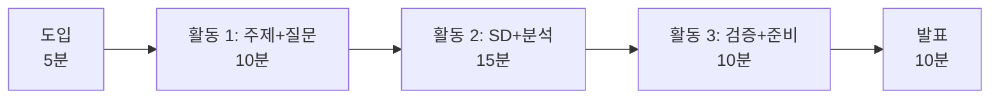
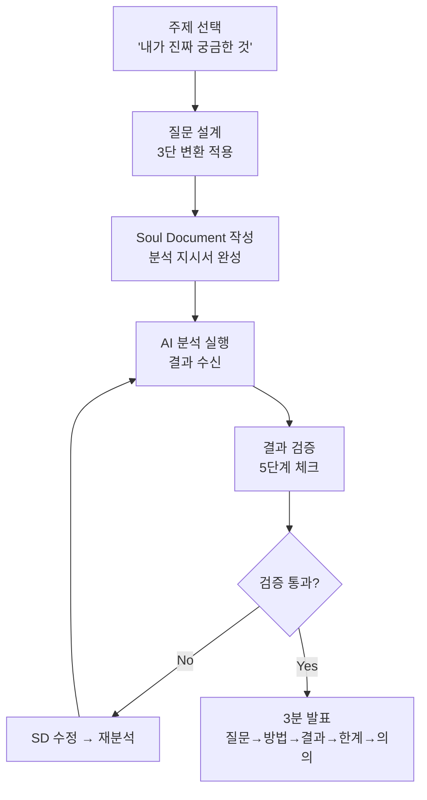
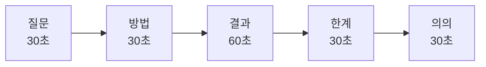
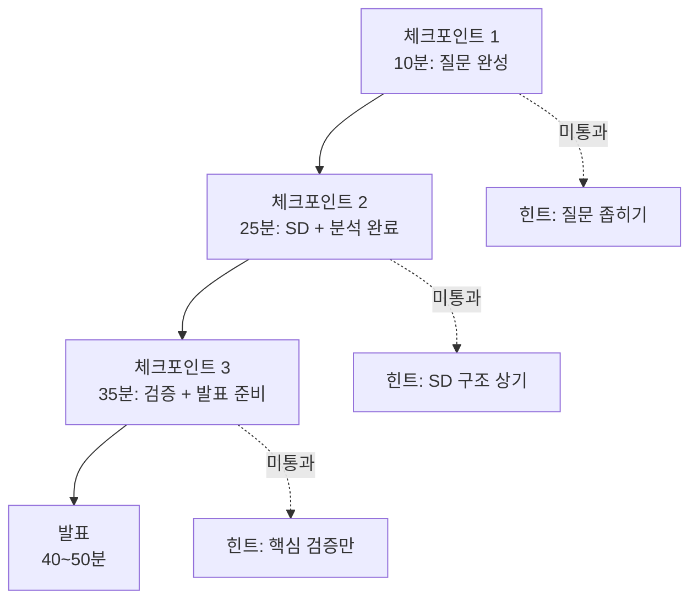

# Ch.9 — 4차시 지도안: 독립 프로젝트

Part 4

## 처음부터 끝까지 혼자 돌려라

1~3차시에서 배운 모든 것을 스캐폴딩 없이 독립 수행합니다. | 2시간

---

## 수업 개요

| 항목 | 내용 |
|:---|:---|
| **차시** | 4차시 (전체 4차시 중 — 최종) |
| **소요 시간** | 50분 (기본) + 확장 가능 (블록 수업 시 100분) |
| **수업 형태** | 개인 또는 2인 1조 |
| **필요 환경** | PC + AI 도구 접근 + 데이터셋 |
| **선수 학습** | 1차시(질문 설계), 2차시(AI 분석+검증), 3차시(피어리뷰) 전체 |
| **핵심 활동** | 독립 프로젝트: 주제 선택 → 질문 설계 → Soul Document → AI 분석 → 검증 → 발표 |
| **준비물** | 프로젝트 보고서 템플릿(Ch.10), 동료 평가 양식, 타이머 |

---

## 핵심 아이디어

!!! abstract "이번에는 아무것도 안 줍니다"
    1차시에는 상황카드를 줬습니다.
    2차시에는 Soul Document 템플릿을 줬습니다.
    3차시에는 검토 렌즈와 양식을 줬습니다.
    **4차시에는 아무것도 주지 않습니다.**

    주제 선택부터 발표까지, 전체 파이프라인을 **스스로 설계하고 실행**합니다.
    이것이 바로 **에이전틱 러닝**의 최종 목표입니다.

### 왜 독립 수행이 중요한가

> "자전거에서 보조 바퀴를 떼는 순간이 진짜 자전거를 배우는 순간입니다."

| 1~3차시 | 4차시 |
|:---|:---|
| 교사가 주제/데이터/양식 제공 | 학생이 직접 선택 |
| 단계별 안내 제공 | 체크포인트만 제공 |
| 구조화된 피드백 양식 | 자기 검증 + 간단 동료 평가 |
| **"이렇게 해 보세요"** | **"알아서 해 보세요"** |

---

## 학습 목표

??? success "학습 목표 3가지"
    1. 스스로 분석 주제를 선택하고 **분석 가능한 질문**으로 변환할 수 있다.
    2. Soul Document를 독립적으로 작성하여 AI 분석을 실행하고, 결과를 **자기 검증**할 수 있다.
    3. 전체 분석 과정과 결론을 **3분 이내로 발표**하고, 동료 평가에 참여할 수 있다.

---

## 50분 수업 타임라인

1

도입: "아무것도 안 줍니다"

5분

2

주제 선택 + 질문 설계

10분

3

Soul Document + AI 분석

15분

4

결과 검증 + 발표 준비

10분

5

3분 발표 x 3~4조

10분

---

## 독립 프로젝트 파이프라인

---

## 단계별 수업 진행

### 도입 (5분): "이번에는 아무것도 안 줍니다"

**교사 발문:**

> "지금까지 3번의 수업을 했습니다. 상황카드도 받았고, 템플릿도 받았고, 검토 양식도 받았습니다.
> 오늘은? **아무것도 안 줍니다.** 주제부터 발표까지 여러분이 직접 합니다."

> "걱정하지 마세요. 여러분은 이미 3번을 했습니다. 방법을 알고 있어요.
> 다만 오늘은 **타이머가 돌아갑니다.** 50분 안에 끝내야 합니다."

**활동:**

1. 오늘의 타임라인을 칠판에 게시 (시간 엄수 강조)
2. 3개 체크포인트 안내 (아래 설명)
3. "질문 있는 사람?" → 없으면 바로 시작

---

### 활동 1 (10분): 주제 선택 + 질문 설계 — 체크포인트 1

학생이 직접 주제를 정하고 분석 가능한 질문으로 변환합니다.

#### 주제 선택 가이드

!!! tip "주제를 못 고르겠다면"
    아래 질문에 답해 보세요:

    1. "요즘 가장 궁금한 것은?" → 그것을 데이터로 확인할 수 있는가?
    2. "어제 친구와 나눈 논쟁은?" → 데이터로 누가 맞는지 확인할 수 있는가?
    3. "학교에서 바꾸고 싶은 것은?" → 그 문제를 숫자로 증명할 수 있는가?

#### 질문 설계: 3단 변환 복습

| 단계 | 변환 | 예시 |
|:---:|:---|:---|
| **1단** | 막연한 궁금증 | "급식이 별로인 것 같은데..." |
| **2단** | 분석 가능한 질문 | "우리 학교 급식 만족도는 메뉴 유형에 따라 다른가?" |
| **3단** | 데이터 역설계 | "급식 만족도(5점 척도) + 메뉴 유형(한식/양식/중식) + 날짜" |

!!! warning "체크포인트 1 — 교사 확인"
    10분 후 교사가 순회하며 확인합니다:

    - [ ] 질문이 "분석 가능한" 형태인가?
    - [ ] 사용할 데이터(또는 데이터 수집 방법)가 정해졌는가?
    - [ ] 기대 결과에 대한 가설이 있는가?

    **미통과 시**: "질문을 좀 더 좁혀 보세요. '전체'가 아니라 '특정 변수 2개의 관계'로."

---

### 활동 2 (15분): Soul Document 작성 + AI 분석 — 체크포인트 2

Soul Document를 작성하고 AI에게 분석을 지시합니다.

#### Soul Document 필수 요소 (자가 점검)

<ul class="verification-checklist" markdown>
<li>분석 목적이 1문장으로 명확히 기술되어 있는가?</li>
<li>사용할 데이터와 주요 변수가 명시되어 있는가?</li>
<li>분석 방법(상관/비교/추세 등)이 지정되어 있는가?</li>
<li>시각화 유형과 출력 형식이 지정되어 있는가?</li>
<li>이상치/결측값 처리 방법이 포함되어 있는가?</li>
<li>결과 해석 시 주의사항(인과 혼동 금지 등)이 포함되어 있는가?</li>
</ul>

!!! warning "체크포인트 2 — 교사 확인"
    25분 경과 시점에 교사가 순회합니다:

    - [ ] Soul Document가 완성되었는가?
    - [ ] AI 분석 결과를 수신했는가?
    - [ ] 최소 1개의 시각화가 생성되었는가?

    **미통과 시**: "Soul Document의 '분석 방법' 부분이 비어 있어요. 상관분석인지 그룹 비교인지 정하세요."

---

### 활동 3 (10분): 결과 검증 + 발표 준비 — 체크포인트 3

결과를 검증하고 3분 발표를 준비합니다.

#### 간이 검증 체크 (5단계 축약)

시간이 제한적이므로, 핵심 3개만 빠르게 확인합니다:

| 검증 항목 | 30초 체크 | 통과? |
|:---|:---|:---:|
| **수치 확인** | N(표본 수)이 맞는가? 평균이 상식적인가? | O / X |
| **시각화 확인** | 그래프가 데이터를 왜곡하지 않는가? | O / X |
| **해석 확인** | 상관을 인과로 바꾸지 않았는가? | O / X |

!!! warning "체크포인트 3 — 교사 확인"
    35분 경과 시점에 교사가 순회합니다:

    - [ ] 검증을 1회 이상 수행했는가?
    - [ ] 발표 구조(질문→방법→결과→한계→의의)를 잡았는가?

    **미통과 시**: "검증을 건너뛰지 마세요. 1분이면 됩니다. 표본 수만이라도 확인하세요."

---

### 발표 (10분): 3분 발표 x 3~4조

#### 발표 구조 가이드

| 구간 | 시간 | 내용 | 팁 |
|:---|:---:|:---|:---|
| **질문** | 30초 | "어떤 궁금증에서 시작했고, 어떤 질문으로 바꿨는가" | 3단 변환 과정을 간단히 |
| **방법** | 30초 | "어떤 데이터로, 어떤 방법으로 분석했는가" | Soul Document 핵심 요약 |
| **결과** | 60초 | "무엇을 발견했는가" — 핵심 그래프 1개 제시 | 그래프를 화면에 띄우고 설명 |
| **한계** | 30초 | "이 분석의 한계는 무엇인가" | 표본, 변수, 인과 한계 |
| **의의** | 30초 | "이 결과가 왜 의미 있는가" | "그래서 뭐?" 에 답하기 |

!!! tip "발표 시간 관리"
    - 교사가 타이머를 화면에 띄움 (카운트다운)
    - 2분 30초에 "30초 남았습니다" 안내
    - 3분 초과 시 부드럽게 마무리 유도
    - **발표 순서**: 자원자 우선, 없으면 랜덤 추첨

---

## 3개 체크포인트 시스템

교사가 수업 중 3번 순회하며 진행 상태를 확인합니다. 학생이 막히면 방향만 제시하되, 대신 해 주지 않습니다.

| 체크포인트 | 시점 | 확인 사항 | 미통과 시 교사 개입 |
|:---:|:---:|:---|:---|
| **CP1** | 10분 | 질문 + 데이터 + 가설 | "좀 더 좁혀 봐" 방향 제시 |
| **CP2** | 25분 | SD 완성 + AI 결과 수신 | "SD에서 빠진 부분 확인해 봐" |
| **CP3** | 35분 | 검증 + 발표 골격 | "검증 1개만 해 봐. 표본 수 확인" |

!!! note "개입의 원칙"
    **최소 개입, 최대 자율.**
    교사는 **"어떻게 해야 할지"**를 알려주는 것이 아니라,
    **"어디서 막혀 있는지"**를 학생 스스로 인식하게 돕습니다.

---

## Plotly 예시: 독립 프로젝트 결과물

학생들이 만들어낼 수 있는 결과물 예시입니다. "이 정도 수준이면 충분하다"는 기준을 보여줍니다.

### 예시 1: 산점도 — 변수 간 관계 탐색

독립 프로젝트 예시: 공부시간과 성적의 관계

<iframe src="../demos/ch09_project_scatter.html"></iframe>

### 예시 2: 막대그래프 — 그룹 간 비교

독립 프로젝트 예시: 동아리 유형별 학교 만족도

<iframe src="../demos/ch09_project_bar.html"></iframe>

!!! note "예시 활용 주의"
    이 예시는 **참고용**입니다. 학생들에게 "이걸 따라하라"가 아니라
    "이 정도 깊이의 분석을 기대한다"는 수준 기준으로 제시하세요.
    주제와 방법은 반드시 학생 스스로 결정해야 합니다.

---

## 동료 평가 간단 양식

발표를 듣는 학생이 간단히 작성하는 양식입니다. 피어리뷰(3차시)보다 훨씬 간소화된 버전입니다.

### 발표자: ________________ | 평가자: ________________

| 항목 | 평가 (1~5) | 한 줄 코멘트 |
|:---|:---:|:---|
| **질문의 명확성**: 분석 질문이 구체적이고 답할 수 있는 형태였는가? | /5 | |
| **분석의 적절성**: 데이터와 방법이 질문에 적합했는가? | /5 | |
| **결과의 설득력**: 그래프와 해석이 설득력 있었는가? | /5 | |
| **한계 인식**: 분석의 한계를 솔직하게 인정했는가? | /5 | |
| **발표 전달력**: 시간 배분, 구조, 전달이 명확했는가? | /5 | |

**이 발표에서 가장 인상 깊었던 점:**

> (1문장)

**하나 개선한다면:**

> (1문장)

---

## 교사 주의사항

### 시간 부족 대처

??? warning "50분 안에 못 끝낼 때"
    현실적으로, 모든 학생이 50분 안에 주제 선택부터 발표까지 끝내기 어려울 수 있습니다.

    **옵션 A: 블록 수업 (100분)**
    - 가장 이상적. 각 활동에 2배 시간 배정.
    - 발표도 전원 가능 (3분 x 10조 = 30분)

    **옵션 B: 2차시 분할**
    - 1차시: 주제 선택 → 질문 설계 → Soul Document → AI 분석 (30분)
    - 2차시: 결과 검증 → 발표 준비 → 발표 + 동료 평가 (20분)

    **옵션 C: 50분 내 완료 (타이트)**
    - 발표 인원을 3~4조로 제한 (나머지는 보고서 제출)
    - 검증을 간이 체크(3항목)로 축약
    - Soul Document는 핵심 4항목만 필수

### 주제 선택 고착 학생 지원

??? tip "5분이 지나도 주제를 못 정하는 학생"
    1. **이전 차시 복기**: "1차시에서 상황카드로 했던 주제 기억나? 그거 비슷한 거 해 봐."
    2. **선택지 3개 제시**: "급식, 수면, 통학 중에 뭐가 제일 궁금해?"
    3. **데이터 먼저**: "여기 데이터셋 3개가 있어. 이 중에서 골라 봐."
    4. **짝 토의**: "옆 친구한테 '요즘 뭐가 궁금해?' 물어봐."

    **주의**: 주제를 **대신 정해주면 안 됩니다.** 선택지를 좁혀주되, 최종 결정은 학생이 합니다.

### 분석이 잘못된 방향으로 갈 때

??? question "AI 분석 결과가 엉망일 때"
    1. **Soul Document 점검 유도**: "SD를 다시 읽어 봐. 빠진 게 있지 않아?"
    2. **핵심 질문**: "네가 AI에게 뭘 시켰어? → AI가 뭘 돌려줬어? → 어디가 다르지?"
    3. **재분석 허용**: "한 번 더 시켜 봐. 이번엔 이상치 처리를 추가해 봐."
    4. **시간 관리**: 재분석은 **1회까지**만 허용. 그래도 안 되면 현재 결과로 발표하되 "한계"로 언급.

---

## 확장 활동: 50분을 넘어서

!!! tip "시간이 더 있다면"
    - **발표 후 Q&A**: 발표 당 1분 질의응답 추가
    - **교차 검증**: 다른 조의 Soul Document로 같은 데이터를 재분석
    - **보고서 작성**: Ch.10의 보고서 템플릿을 활용하여 정식 보고서 완성
    - **온라인 게시**: 최종 보고서를 학급 게시판에 공유

---

!!! abstract "이 챕터의 핵심"
    - 4차시는 **스캐폴딩 없이** 전체 분석 파이프라인을 독립 수행한다
    - 3개 체크포인트로 교사가 **최소 개입**하며 진행을 모니터링한다
    - 3분 발표는 **질문 → 방법 → 결과 → 한계 → 의의** 구조를 따른다
    - 시간 부족 시 **블록 수업, 2차시 분할, 발표 인원 제한** 등으로 조절한다

[← Ch.8 피어리뷰 양식](chapter08.md){ .md-button } &nbsp; [Ch.10 종합 평가 →](chapter10.md){ .md-button .md-button--primary }

