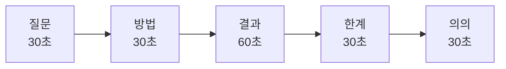
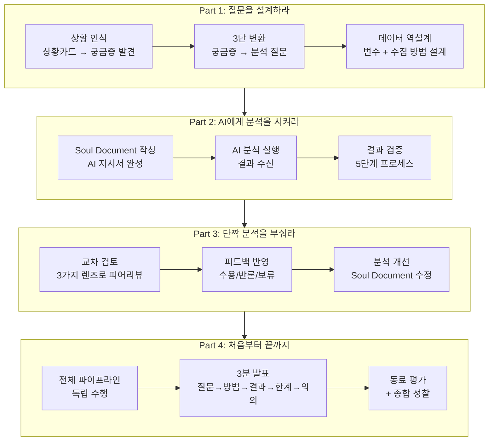

# Ch.10 — 프로젝트 템플릿·발표 가이드·시리즈 종합 평가

Part 4

## 처음부터 끝까지 혼자 돌려라 — 수업 자료

독립 프로젝트 보고서 템플릿, 발표 가이드, 동료 평가 양식, 그리고 4차시 전체 종합 평가 루브릭을 담았습니다. | 50분

---

## 독립 프로젝트 보고서 템플릿

!!! note "사용 안내"
    이 템플릿은 4차시 독립 프로젝트의 최종 결과물입니다.
    항목을 빠짐없이 작성하되, 분량보다 **논리적 일관성**에 집중하세요.

---

### 1. 연구 질문

> **작성 가이드**: 3단 변환 과정을 보여주세요.

| 단계 | 내용 |
|:---|:---|
| **막연한 궁금증** | (예: "급식이 왜 맛없을까?") |
| **분석 가능한 질문** | (예: "메뉴 유형에 따라 급식 만족도에 차이가 있는가?") |
| **가설** | (예: "한식 메뉴가 양식 메뉴보다 만족도가 높을 것이다") |

---

### 2. 배경 맥락

> **작성 가이드**: 이 질문이 왜 중요한지, 어떤 배경에서 나온 것인지 설명하세요.

- 이 주제에 관심을 갖게 된 계기:
- 이 질문이 중요한 이유:
- 기존에 알려진 것 (있다면):

---

### 3. 사용 데이터 설명

> **작성 가이드**: 데이터의 출처, 규모, 주요 변수를 명시하세요.

| 항목 | 내용 |
|:---|:---|
| **데이터 출처** | (예: 학교 급식 만족도 설문, 2025년 11월 실시) |
| **표본 크기** | (예: N = 156명) |
| **주요 변수** | (예: 만족도(5점 척도), 메뉴 유형(한식/양식/중식), 학년) |
| **결측값** | (예: 12건 결측, 해당 행 제외 처리) |
| **수집 방법** | (예: 구글 폼 설문) |

---

### 4. 분석 지침서 / Soul Document (AI 지시 내용)

> **작성 가이드**: AI에게 보낸 지시서의 핵심 내용을 기록하세요.

나의 Soul Document

분석 목적: (기록)

사용 데이터: (기록)

전처리 지시: (기록)

분석 방법: (기록)

출력 형식: (기록)

주의사항: (기록)

**Soul Document 수정 이력** (있다면):

| 버전 | 수정 내용 | 수정 이유 |
|:---:|:---|:---|
| v1 → v2 | | |
| v2 → v3 | | |

---

### 5. 분석 결과 (AI 출력)

> **작성 가이드**: AI가 돌려준 핵심 결과를 정리하세요. 그래프 1~2개 + 주요 수치를 포함합니다.

**기초 통계량:**

| 변수 | N | 평균 | 중앙값 | 표준편차 | 최솟값 | 최댓값 |
|:---|:---:|:---:|:---:|:---:|:---:|:---:|
| | | | | | | |
| | | | | | | |

**핵심 분석 결과:**

- 결과 1:
- 결과 2:
- 결과 3:

**핵심 시각화:** (그래프 캡처 또는 AI 출력물 첨부)

---

### 6. 결과 검증 기록

> **작성 가이드**: 5단계 검증 중 수행한 항목과 결과를 기록하세요.

| 검증 단계 | 수행 여부 | 결과 |
|:---|:---:|:---|
| Step 1: 수치 확인 | O / X | |
| Step 2: 시각화 확인 | O / X | |
| Step 3: 상식 검증 | O / X | |
| Step 4: 민감도 분석 | O / X | |
| Step 5: 대안 분석 | O / X | |

**검증을 통해 발견한 문제와 수정 사항:**

> (있다면 기록)

---

### 7. 최종 결론 및 한계

> **작성 가이드**: 데이터가 지지하는 결론만 작성하세요. 과잉 해석을 피하세요.

**결론:**

> (데이터에 근거한 결론을 1~3문장으로)

**한계:**

- 한계 1: (예: 표본이 우리 학교 1학년에 국한)
- 한계 2: (예: 상관관계이지 인과관계가 아님)
- 한계 3: (예: 설문 응답의 성실성을 통제하지 못함)

**후속 연구 제안:**

> (이 분석을 발전시킨다면 무엇을 더 하겠는가?)

---

## 3분 발표 구조 가이드

### 시간 배분

### 구간별 상세 가이드

#### 질문 (30초)

> "저는 ___이(가) 궁금했습니다. 그래서 '___'라는 질문을 만들었습니다."

- 3단 변환 과정을 1~2문장으로 압축
- 청중이 "아, 그게 궁금하구나"라고 공감할 수 있도록
- **피해야 할 것**: 장황한 배경 설명

#### 방법 (30초)

> "___데이터(N=__)를 사용해서 ___방법으로 분석했습니다."

- 데이터 출처 + 표본 크기 + 분석 방법을 간결하게
- Soul Document의 핵심을 1문장으로
- **피해야 할 것**: 기술적 용어 나열

#### 결과 (60초) — 가장 중요

> "분석 결과, ___를 발견했습니다." (그래프를 화면에 띄우며)

- 핵심 그래프 **1개**를 화면에 띄우고 설명
- 그래프에서 **어디를 봐야 하는지** 손으로 가리키며 안내
- 수치 1~2개를 구체적으로 언급
- **피해야 할 것**: 그래프를 보여주고 설명 없이 넘어가기

#### 한계 (30초)

> "하지만 이 분석에는 ___라는 한계가 있습니다."

- 가장 큰 한계 1~2개만 솔직하게
- "그래서 이 결론을 ___범위에서만 적용할 수 있습니다"
- **피해야 할 것**: 한계를 숨기거나 넘어가기

#### 의의 (30초)

> "그럼에도 이 분석은 ___라는 점에서 의미가 있다고 생각합니다."

- "그래서 뭐?" 에 대한 답
- 실생활 적용 가능성, 후속 연구 방향
- **피해야 할 것**: "이상입니다"로 끝내기

### 슬라이드 구성 (선택)

발표 시 슬라이드를 사용할 경우:

| 슬라이드 | 내용 | 비고 |
|:---:|:---|:---|
| 1 | 제목 + 질문 | 질문을 한 줄로 크게 |
| 2 | 데이터 + 방법 요약 | 표본 크기, 변수, 방법 |
| 3 | 핵심 그래프 | **가장 중요한 슬라이드** |
| 4 | 결론 + 한계 + 의의 | 3개를 한 슬라이드에 |

!!! tip "슬라이드 팁"
    - 슬라이드는 **최대 4장**. 그 이상은 3분에 못 넘김.
    - 텍스트는 최소화, **그래프와 핵심 수치**를 크게.
    - 슬라이드 없이 그래프 화면만 띄워도 충분합니다.

---

## 동료 평가 양식 (발표 청중용)

### 발표자: ________________ | 평가자: ________________

| 항목 | 평가 | 한 줄 코멘트 |
|:---|:---:|:---|
| **질문의 명확성** — 무엇을 분석했는지 이해가 되었는가? | 1 2 3 4 5 | |
| **분석의 적절성** — 데이터와 방법이 질문에 적합했는가? | 1 2 3 4 5 | |
| **결과의 설득력** — 그래프와 해석이 납득이 되었는가? | 1 2 3 4 5 | |
| **한계 인식** — 분석의 한계를 솔직하게 밝혔는가? | 1 2 3 4 5 | |
| **발표 전달력** — 시간 배분과 전달이 명확했는가? | 1 2 3 4 5 | |

**총점: ___ / 25**

**이 발표에서 가장 인상 깊었던 점:**

> (구체적으로 작성)

**하나 개선한다면:**

> (구체적 제안)

---

## 시리즈 종합 루브릭 (4차시 전체 평가)

이 루브릭은 4차시 전체를 통합 평가하는 최종 루브릭입니다.

<table class="rubric-table">
<thead>
<tr>
<th>평가 영역</th>
<th>탁월 (4)</th>
<th>우수 (3)</th>
<th>보통 (2)</th>
<th>미흡 (1)</th>
</tr>
</thead>
<tbody>
<tr>
<td><strong>질문 설계 역량</strong> (1차시)</td>
<td>막연한 궁금증을 체계적으로 분석 가능한 질문으로 변환하고, 적합한 변수와 데이터를 독립적으로 설계함</td>
<td>3단 변환을 수행하나, 변수 설계나 데이터 역설계에서 약간의 모호함이 있음</td>
<td>질문을 만들었으나, 분석 가능한 형태가 아니거나 변수가 불명확함</td>
<td>질문을 만들지 못하거나, 교사의 직접적 도움 없이 진행하지 못함</td>
</tr>
<tr>
<td><strong>분석 지시 역량</strong> (2차시)</td>
<td>완성도 높은 Soul Document를 작성하여 AI로부터 정확한 분석 결과를 얻고, 전처리까지 지시함</td>
<td>Soul Document의 핵심 요소(목적, 데이터, 방법)는 갖추었으나, 세부 지시(전처리, 주의사항)가 부족</td>
<td>Soul Document가 불완전하여 AI 결과의 품질이 낮고, 재분석이 여러 차례 필요</td>
<td>Soul Document를 작성하지 못하거나, AI에게 구조화된 지시를 하지 못함</td>
</tr>
<tr>
<td><strong>비판적 검토 역량</strong> (3차시)</td>
<td>3가지 렌즈를 모두 활용하여 동료 분석의 구체적 문제를 발견하고, 근거 있는 대안을 제시함</td>
<td>렌즈를 활용하여 문제를 발견하나, 대안 제시가 구체적이지 않거나 일부 렌즈가 약함</td>
<td>피드백을 작성하나 추상적이며, 근거보다 감상에 의존함</td>
<td>의미 있는 피드백을 제공하지 못하거나, 피어리뷰에 소극적으로 참여함</td>
</tr>
<tr>
<td><strong>종합 수행 역량</strong> (4차시)</td>
<td>스캐폴딩 없이 전체 파이프라인을 독립 수행하고, 검증과 한계 인식이 포함된 완성도 높은 발표를 함</td>
<td>전체 파이프라인을 수행하나, 일부 단계(검증 또는 한계 인식)가 부족함</td>
<td>파이프라인을 수행하나 여러 단계에서 교사 도움이 필요했고, 결과물이 미완성</td>
<td>독립 수행이 어려워 대부분의 단계에서 교사 또는 동료의 직접적 도움을 받음</td>
</tr>
<tr>
<td><strong>데이터 리터러시</strong> (전체)</td>
<td>상관과 인과를 구분하고, 이상치의 영향을 인식하며, 일반화 범위를 적절히 제한함</td>
<td>데이터 해석의 기본 원칙을 이해하나, 일부 오류(과잉 일반화 등)가 남아 있음</td>
<td>데이터를 읽을 수 있으나, 해석에서 체계적 오류(인과 혼동 등)가 반복됨</td>
<td>데이터를 표면적으로만 읽고, 비판적 해석을 시도하지 못함</td>
</tr>
</tbody>
</table>

!!! note "채점 기준"
    - **17~20점 (탁월)**: 에이전틱 러닝(학생 주도 AI 활용 학습)의 목표를 완전히 달성
    - **13~16점 (우수)**: 대부분의 역량을 갖추었으며 소폭 보완 필요
    - **9~12점 (보통)**: 기본적 수행은 했으나 깊이와 독립성이 부족
    - **5~8점 (미흡)**: 추가 지도가 필요한 수준

---

## 교사 성찰 체크리스트

수업 운영 후 교사 자신을 점검하는 체크리스트입니다.

<ul class="verification-checklist" markdown>
<li>학생들이 "AI에게 시키는 사람"이 아니라 "AI를 도구로 쓰는 주체"로 활동했는가?</li>
<li>스캐폴딩을 점진적으로 줄여, 4차시에는 학생이 독립적으로 수행할 수 있었는가?</li>
<li>질문 설계 단계에서 학생의 주도성이 발휘되었는가? (교사가 대신 질문을 만들지 않았는가?)</li>
<li>검증 단계를 "귀찮은 추가 작업"이 아니라 "핵심 역량"으로 인식시켰는가?</li>
<li>피어리뷰에서 갈등 없이 건설적 피드백이 오갔는가? (갈등이 있었다면 적절히 중재했는가?)</li>
<li>시간 배분이 적절했는가? 특정 활동에 시간이 치우치지 않았는가?</li>
<li>소극적/고착 학생에게 적절한 지원(최소 개입 원칙)을 제공했는가?</li>
<li>데이터 리터러시(상관 vs 인과, 이상치, 일반화)가 자연스럽게 학습되었는가?</li>
<li>학생들의 최종 결과물에 "한계 인식"이 포함되어 있는가?</li>
<li>학생들이 "다음에도 이런 분석을 해 보고 싶다"고 느꼈는가?</li>
</ul>

??? question "성찰 후 개선 포인트"
    - **체크 안 된 항목이 3개 이상**이면: 해당 차시의 활동 설계를 재검토
    - **시간 배분 문제**가 반복되면: 블록 수업 또는 2차시 분할 고려
    - **학생 주도성 부족**이면: 스캐폴딩 제거 시점을 앞당기는 실험
    - **피어리뷰 갈등**이 심했다면: 피드백 규칙 강화 + 사전 연습 추가

---

## 시리즈 전체 구조 종합도

4차시 전체의 학습 여정을 한눈에 볼 수 있는 종합 흐름도입니다.

### 역량 성장 경로

| 차시 | 핵심 역량 | 스캐폴딩 수준 | 학생 주도성 |
|:---:|:---|:---:|:---:|
| **1차시** | 질문 설계 | 높음 (상황카드+템플릿) | 30% |
| **2차시** | 분석 지시 + 검증 | 중간 (SD 템플릿+체크리스트) | 50% |
| **3차시** | 비판적 검토 | 중간 (렌즈+양식) | 70% |
| **4차시** | 종합 수행 | 낮음 (체크포인트만) | 90% |

---

## 수업 확장 아이디어

!!! tip "이 수업을 더 발전시키려면"

### 2학기 심화 수업

| 확장 주제 | 내용 | 추가 역량 |
|:---|:---|:---|
| **데이터 수집 프로젝트** | 설문지 직접 설계 → 배포 → 수거 → 분석 | 데이터 수집 설계 역량 |
| **공공 데이터 탐구** | KOSIS, 공공데이터포털 등 실제 데이터 활용 | 대규모 데이터 탐색 역량 |
| **다변량 분석** | 변수 3개 이상 동시 분석 | 교란 변수 통제, 다중 회귀 이해 |
| **인포그래픽 제작** | 분석 결과를 시각적 보고서로 완성 | 데이터 커뮤니케이션 역량 |

### 동아리 활동

- **데이터 저널리즘 동아리**: 학교/지역 이슈를 데이터로 취재하여 기사 작성
- **AI 분석 대회**: 주제를 주고 팀별 분석 → 발표 → 심사
- **데이터 멘토링**: 4차시를 이수한 학생이 후배에게 피어티칭

### 방과후 수업

- **4차시 → 8차시 확장**: 데이터 수집까지 포함한 풀 사이클
- **프로젝트 포트폴리오**: 학기 중 3~4개 프로젝트를 포트폴리오로 정리
- **교과 연계**: 사회, 과학, 보건 등 교과 데이터를 활용한 융합 수업

??? success "확장 시 핵심 원칙"
    어떤 형태로 확장하든, 아래 3가지 원칙은 유지합니다:

    1. **학생이 주체**: AI는 도구, 학생은 의사결정자
    2. **검증이 핵심**: 결과를 받고 끝이 아니라, 반드시 검증
    3. **한계 인식**: 완벽한 분석은 없다. 한계를 아는 것이 진짜 역량

---

## 마무리 메시지

!!! abstract "선생님께 드리는 말씀"

    이 수업을 끝까지 읽어 주셔서 감사합니다.

    **"데이터로 세상을 읽는 힘"** 은 21세기에 가장 중요한 역량 중 하나입니다.
    그런데 이 힘은 엑셀 함수를 외우거나 통계 공식을 암기하는 것이 아닙니다.

    - **좋은 질문**을 던지는 것
    - AI에게 **정확히 지시**하는 것
    - 결과를 **비판적으로 검증**하는 것
    - 자신의 분석의 **한계를 솔직히 인정**하는 것

    이 네 가지가 데이터 리터러시의 본질이며, 이 수업이 추구한 목표입니다.

!!! quote "여러분의 학생들이 데이터로 세상을 읽는 힘을 갖게 되기를"

    숫자 뒤에 숨은 이야기를 찾아내고,
    그래프 너머의 맥락을 읽어내고,
    "정말 그런가?" 라고 질문할 줄 아는 사람.

    그런 사람을 키우는 것이 이 수업의 존재 이유입니다.
    선생님의 교실에서 그 변화가 시작되기를 진심으로 응원합니다.

---

[← Ch.9 독립 프로젝트 지도안](chapter09.md){ .md-button } &nbsp; [처음으로 돌아가기 →](index.md){ .md-button .md-button--primary }

